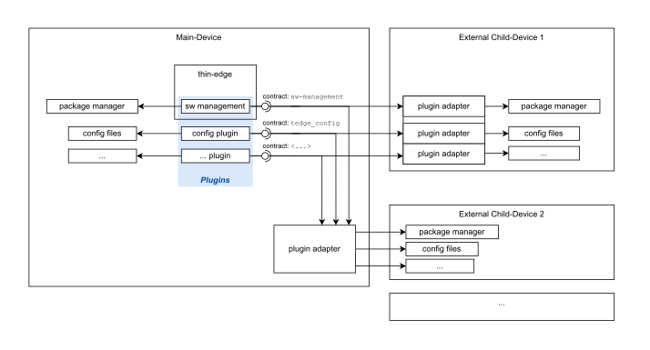
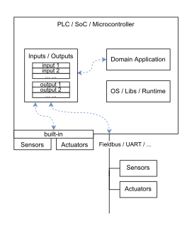

# thin-edge Domain Model

The following section introduces the **thin-edge** domain model.

**thin-edge** is the glue between the **cloud** and **devices**. I.e. it interfaces on the one hand **devices** (especially resource constrained industrial **devices**), and connects on the other hand the **cloud**.
The **cloud** could be some IoT Cloud Platform, such as [Cumulocity](https://www.softwareag.cloud/site/product/cumulocity-iot.html), [Azure](https://azure.microsoft.com) or [AWS](https://aws.amazon.com); or an on-premise "IoT system".

**thin-edge** has been designed with the assumption that the **device** is represented in the **IoT cloud** as **device twin**.
The **device twin** in the IoT cloud is a logical representation of the **device**. As such, it carries or references **Telemetry Data**, and stores the _state_ of the **device**.
Here _state_ refers to e.g. **Device Management** details as _installed software versions_ or _configurations_.

## Telemetry Data

**Telemetry data** are _measurements_, _events_ and _alarms_.

  * **Measurement**:
     * has a _type name_
     * carries a _time-series_ of **samples**
       * a **sample** is a single value or set of values, all taken at a single point in time
         * could be a mix of values coming from physical **Sensors**[^1] and the device's **Domain Application**[^1];
           e.g. _voltage_ and _current_ of an electricity meter, and current state of the manufacturing control process
         * all **sample's** values could be a mix of numbers, strings or booleans
         * a **sample** has _one_ timestamp
       * a _sequence_ of **samples** is a set of **samples** over a period of time;
         e.g. _voltage_ and _current_ captured in a fixed interval
     * a measurement optionally holds individual _units_ for the values of the **samples**
     * a measurement relates to a source, i.e. a device or a process
  * **Setpoint**, is a single value or set of values
    * the values are process variables, used by the **Domain Application**[^1]; 
      e.g. the _lower limit_ and the _upper limit_ of a climate control process
    * the values are visible in the cloud, similar to measurements
    * the values can be manipulated from cloud-site or the device-site
      * each manipulation is processed asynchronously;
        i.e. once new values were set, those are used by the **Domain Application**[^1] from next control-cycle on
    * the values could be a mix of numbers, strings or booleans
  * **Event**, is a notification that something happened on the device's environment or software system
    * has one timestamp
    * common triggers for an **event** can be
      * a _sensor's[^1] value_ that detects something like a door has been closed
      * a signal from the device's _domain application_[^1]
      * a device's _system notification_ that e.g. a user has started an ssh session
    * the interpretation of a _sensor's value_, a _domain application's_ signal or a _system's notification_
     that shall represent an **event** trigger falls to some custom specific software piece
      * whenever that software piece interprets an **event** trigger, it uses the **thin-edge** API to send an event notification to **thin-edge**
* **Alarm**, similar to **events**; but in addition: 
    * the _End User_ (an operator of the system) has to take action to resolve the **alarm**
    * also the _custom specific sw component_ can send a notification to **thin-edge** to clear an **alarm**  

## Device Management

**Device Management** allows managing and monitoring devices in the field from the cloud.
That includes:
  * **Software Management**:
    * allows managing the installed software packages on the device, as
      * retrieve list and versions of installed packages
      * install new or update existing software packages
      * remove installed software packages
    * software packages are installable units on the device, as e.g.
      * packages for a Linux Packages Managers (e.g. for Debian, ...)
      * container images (e.g. for Docker)
      * simple ZIP files
      * custom specific files/packages
    * software packages can carry:
      * the **domain application**[^1]
      * parts from **OS / Libs / Runtime**[^1], or the whole thing as one
      * **thin-edge** itself
  * **Firmware Management**:
    * allows to update the _OS base-image_ of the device as one (e.g. the Linux distribution)
    * a firmware update might dictate a new software list and new configurations
      * i.e. _software modules_ previously installed with **Software Management** might be gone after a firmware update;
        e.g. when those _software modules_ were installed into the area of the _OS base-image_
      * the actual behaviour of **Software Management** together with **Firmware Management** depends on details of the
        specific deployment and package management of the custom device
      * same also applies for **Configuration Management** together with **Firmware Management**
  * **Configuration Management**:
    * allows viewing and changing configurations on the device, as
      * list available configurations
      * transfer individual configurations from device to cloud, and vice versa
    * a configuration is a text file or a binary file, as e.g.
      * configuration file(s) of the **domain application**[^1]
      * configuration file(s) of **OS / Libs / Runtime**[^1]
      * configuration file(s) of **thin-edge** it-self
  * **Log Management**:
    * allows viewing logs from the device
      * lists available logs
      * transfer individual logs from device to cloud
    * a log is a text file, as e.g.
      * log file(s) of the **domain application**[^1]
      * log file(s) of **OS / Libs / Runtime**[^1]
      * log file(s) of **thin-edge** it-self
  * **Device Monitoring**:
    * collects metrics (e.g. cpu, memory and disk metrics) from the device and forward these to the IoT cloud
    * allows monitoring the health of devices
    * helps troubleshooting when problems with the device are reported

[^1]: more details see appendix [Device Domain](#device-domain)

## Child-Devices

**thin-edge** facilitates IoT functionality to the device it is running on, as well as to devices that are connected to that device.
  * the device **thin-edge** is running on is referred as the **main-device**
    * **thin-edge** on the **main-device** establishes and manages all communication to the cloud
  * all devices connected to the **main-device** are referred as **external child-devices** 
  * each **external child-device** can be represented in the cloud with its individual **device twin**
    * a unique **child-id** makes the association between each **external child-device** and it's **device twin**
  * all **telemetry data** and **device management** functionality can appear in the context of the 
    **external child-device's** individual **device twin**, or the **main-device's** **device twin**
  * also _containers_ or _processes_ running on the **main-devices** can be handled like **external child-device**;
    those are referred then as **logical child-devices**

The figure below illustrates the child-device concept.

## Plugins

**thin-edge** realizes **Device Management** based on **plugins**.
  * a **plugin** can be an (external) executable (e.g. as the `c8y-configuration-plugin` for _configuration management_)
    or part of a thin-edge built-in software component (e.g. _software management_ in `tedge-agent`)
  * to realize **Device Management** functionality, a **plugin** accesses _resources_ and _services_ of the device, as e.g.
      * _software management_ uses the device's _package manager_
      * _configuration management_ reads/writes device's _configuration files_
  * a **plugin** can facilitate **Device Management** functionality for the **main-device** and **external child-devices**, or even containers on the **main-device** (e.g. docker containers)
    * a **plugin** runs usually on the **main-device**
    * _resources_ and _services_ (e.g. file system, package manager, ...) of **external child-devices** or other containers can not accessed directly by the **plugin**
    * the access to those _resources_ and _services_ is established by another software component, referred as **plugin adapter**
      * a **plugin adapter** can run on the **external child-device** or inside the container, and provides access via network to the **plugin**

The figure below illustrates the concept of **plugins** and **plugin adapters**.

### Plugin Adapter

A **plugin adapter** is the counterpart of a **plugin**, that takes the responsibility to access the **external child-device's** or container's _resources_ and _services_.
  * a **plugin adapter** can serve one or more **plugins**
  * for access to an **external child-device**, the **plugin adapter** can be installed and executed on that **external child-device**, or on the **main-device**
    * if it runs on the **external child-device** it can access the _resources_ and _services_ directly
    * if it runs on the **main-device** it can use any (low-level) interfaces the **external child-device** provides to access those _resources_
      * One main reason to install the **plugin adapter** on the **main-device** is, when the **external child-device** cannot or shall not be altered.
  * for access to another container, the **plugin adapter** can be installed and executed inside that container, where it can access the _resources_ and _services_ directly

### Plugin-Identifier and Contract

A **plugin** defines and implements a specific **contract** for all interactions with a **plugin adapter**
  * part of the **contract** could be e.g.:
      * the **plugin adapter** must listen and react to certain requests of the **plugin**, e.g. on MQTT
      * the **plugin adapter** must provide/consume files to/from the **plugin** on purpose, e.g. via HTTP
      * ...and more...
  * a **plugin** can be flagged with a unique _plugin-identifier_ (e.g. `tedge_config`, `tedge_software` or any other unique string for a custom specific plugin)
    * based on that _plugin-identifier_ a **plugin adapter** can report and find **plugins** the child-device intends to contact (e.g. during provisioning phase)
    * a **plugin** and a **plugin adapter** using the same _plugin-identifier_ can assume to implement the same **contract**, and to be compatible with each other

## Inventory

**thin-edge** holds and manages an **inventory** on the **main-device**, that stores and provides information about the **main-device** and known **child-devices**
  * information stored per **device** are
    * supported kinds of **Device Management** capabilities/operations
    * supported kinds of **Telemetry Data**
    * optionally any custom-specific meta-information per **device**
  * the **inventory** is the communication backbone for **plugins**, **external child-devices**, the **domain application**[^1] and **thin-edge** it-self
      * one can add information to announce capabilities a **device** supports
      * another one can retrieve those information to identify capabilities a **device** supports

# Appendix

## Device Overview

**thin-edge** is designed to facilitate IoT functionality to resource constrained **devices**. The focus is on industrial OT **devices** or any other kind of embedded **devices**. It is not reduced to **devices** that are capable to install and run thin-edge, but includes also **devices** that need another _(gateway) device_ aside, that executes **thin-edge**.

Usual **devices** are **PLCs** (**P**rogrammable **L**ogic **C**ontrollers), **IPCs** (**I**ndustrial **PC**s) or any kind of **SoC-based** or **Microcontroller-based** Embedded System. The figure below shows a simplified conceptual model of such a device.

<!--
* TODO: add somehow "Such a **device** is most often a specialized hardware that has been ruggedized to operate in harsh electrical, thermic and mechanical industrial environments."
-->
* The **Domain Application** is a program, that contains the domain specific process logic.
  * On a **PLC** it's a _control application_, created by an _automation engineer_ in a domain specific graphical programming language (like "Ladder Diagram" or "Function block diagram")
  * Or on a **SoC-based** or **Microcontroller-based** system it's an _application program_, created by an _embedded software engineer_ usually in C/C++
* The **OS / Libs / Runtime** provide basic functionality to the **Domain Application**
  <!-- TODO: add somehow "used to abstract the hardware. But: on a microcontroller usually less abstraction, more hw dep on the domain app, and even no OS" -->
* **Sensors** and **Actuators** enable the **device** to observe and control physical behaviour on the shopfloor or device's environment.
  * can be integrated in the **device's** hardware,
    or connected to the **device** via some **Fieldbus** (e.g. Modbus, CANopen, PROFINET, EtherCAT, ...) or
    some **Local Interface** as USB, UART, SPI, I2C, ...
  * can be simple peripherals as a light barrier, or a sensor for temperature or pressure;
    or complex equipment as robotic arms or even other **devices**
* **Inputs / Outputs** are the communication channels between the **Domain Application** and **Sensors** and **Actuators**
  * drivers (as part of the **OS / Libs / Runtime** and/or the **Domain Application**) do expose all data from
    **Sensors** and **Actuators** to the **device** as inputs or outputs
  * also the **Domain Application** can expose data as input or output (e.g. own _signals_ or _states_)
