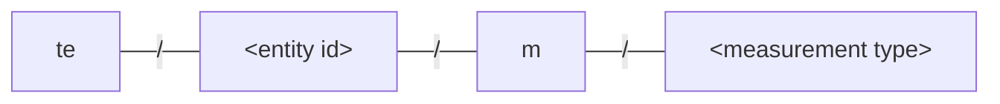
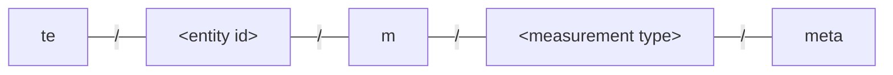

The Cumulocity mapper, referred to as `c8y-mapper` in the rest of this document,
maps data in [%%te%% format](../mqtt-api.md) into their equivalent [Cumulocity format](https://cumulocity.com/docs/smartrest/smartrest-two/).


## Registration

Cumulocity keeps the record of all the registered devices and their associated metadata in its inventory.
The `c8y-mapper` creates and maintains inventory entries for all the devices and services registered with %%te%%.
The mapper subscribes to the following topics to get a list of all registered devices and services:

```sh
mosquitto_sub -t 'te/+' -t 'te/+/+' -t 'te/+/+/+' -t 'te/+/+/+/+'
```

The registration messages received for child devices and services are mapped as follows:

### Child device

<div class="code-indent-left">

**%%te%% (input)**

```text title="Topic"
te/device/child01//
```

```json5 title="Payload"
{
  "@type": "child-device",
  "name": "child01",
  "type": "SmartHomeHub"
}
```

</div>

<div class="code-indent-right">

**Cumulocity (output)**

```text title="Topic"
c8y/s/us
```

```text title="Payload"
101,<main-device-id>:device:child01,child01,SmartHomeHub,false
```

</div>

Where the `<main-device-id>` is added as the prefix to the external id to avoid id clashes
with devices using the same name in other tedge deployments connected to the same tenant.

### Child device with explicit id

<div class="code-indent-left">

**%%te%% (input)**

```text title="Topic"
te/device/child01//
```

```json5 title="Payload"
{
  "@type": "child-device",
  "@id": "child01",
  "name": "child01",
  "type": "SmartHomeHub"
}
```

</div>

<div class="code-indent-right">

**Cumulocity (output)**

```text title="Topic"
c8y/s/us
```

```text title="Payload"
101,child01,child01,SmartHomeHub,false
```

</div>

Where the provided `@id` is directly used as the external id.

### Nested child device

<div class="code-indent-left">

**%%te%% (input)**

```text title="Topic"
te/device/nested_child01//
```

```json5 title="Payload"
{
  "@type": "child-device",
  "@parent": "device/child01//",
  "name": "nested_child01",
  "type": "BatterySensor"
}
```

</div>


<div class="code-indent-right">

**Cumulocity (output)**

```text title="Topic"
c8y/s/us/<main-device-id>:device:child01
```

```text title="Payload"
101,<main-device-id>:device:nested_child01,nested_child01,BatterySensor,false
```

</div>

### Main device service

<div class="code-indent-left">

**%%te%% (input)**

```text title="Topic"
te/device/main/service/nodered
```

```json5 title="Payload"
{
  "@type": "service",
  "name": "Node-Red",
  "type": "systemd"
}
```

</div>


<div class="code-indent-right">

**Cumulocity (output)**

```text title="Topic"
c8y/s/us
```

```text title="Payload"
102,<main-device-id>:device:main:service:nodered,systemd,Node-Red,up
```

</div>

### Child device service

<div class="code-indent-left">

**%%te%% (input)**

```text title="Topic"
te/device/child01/service/nodered
```

```json5 title="Payload"
{
  "@type": "service",
  "name": "Node-Red",
  "type": "systemd"
}
```

</div>


<div class="code-indent-right">

**Cumulocity (output)**

```text title="Topic"
c8y/s/us/<main-device-id>:device:child01
```

```text title="Payload"
102,<main-device-id>:device:child01:service:nodered,systemd,Node-Red,up
```

</div>

Where the unique external IDs to be used in the cloud are derived from the entity identifier subtopics,
replacing the `/` characters with `:`.

:::note
The main device is registered with the cloud via the `tedge connect c8y` command execution
and hence there is no mapping done for main device registration messages.
Inventory data updates for the main device are handled differently.
:::

## Auto Registration of an entity

Before any data messages from an entity can be processed, the entity has to be registered first.
The entity can be registered either explicitly or implicitly (Auto registration).

With auto-registration, an entity does not need to explicitly send a registration message,
and the registration is done automatically by the mapper on receipt of the first message from that entity.
But, auto-registration is allowed only when the entity follows the default topic scheme: `te/device/<device-id>/service/<service-id>`.

For example, sending a measurement message to `te/device/child1///m/temperature` will result in the auto-registration of the device entity with topic id: `device/child1//` and the auto-generated external id: `<main-device-id>:device:child1`, derived from the topic id.
Similarly, a measurement message on `te/device/child1/service/my-service/m/temperature` results in the auto-registration of both
the device entity: `device/child1//` and the service entity: `device/child1/service/my-service` with their respective auto-generated external IDs, in that order.

**Pros:**
* No need to have a separate registration message for an entity.
   This would be ideal for simple devices where programming an additional registration logic is not possible ( e.g: simple sensors that can only generate telemetry messages).

**Cons:**
* Auto-registration of all entities is not possible in complex deployments with nested/hierarchical devices, as the parent of a nested child device can't be identified solely from its topic id (e.g: `te/device/nested-child//`).
The parent information must be provided explicitly using a registration message so that any nested child devices are not wrongly auto-registered as immediate child devices of the main device.
* Auto-registration results in the auto-generation of the device external id as well. If the user wants more control over it, then an explicit registration must be done.
	
Auto-registration can be enabled/disabled based on the complexity of the deployment.
For simpler deployments with just a single level child devices, following the default topic scheme,
auto-registration can be kept enabled.
For any complex deployments requiring external id customizations or with nested child devices,
auto-registration **must be disabled**.

Auto-registration can be disabled using the following `tedge config` command:
```sh
sudo tedge config set c8y.entity_store.auto_register false
```

Auto-registration is enabled, by default.
When the auto registration is disabled, and if the device is not explicitly registered,
then the c8y-mapper will ignore all the data messages received from that device,
logging that error message on the `te/errors` topic indicating that the entity is not registered.


## Telemetry

Telemetry data types like measurements, events and alarms are mapped to their respective equivalents in Cumulocity as follows:

### Measurement

<div class="code-indent-left">

**%%te%% (input)**

```text title="Topic"
te/device/main///m/environment
```

```json5 title="Payload"
{
  "temperature": 23.4
}
```

</div>

<div class="code-indent-right">

**Cumulocity (output)**

```text title="Topic"
c8y/measurement/measurements/create
```

```json5 title="Payload"
{
  "type": "environment",
  "time": "2021-04-22T17:05:26.958340390+00:00",
  "temperature": {
    "temperature": {
      "value": 23
    }
  }
}
```

</div>


#### Measurement without type

<div class="code-indent-left">

**%%te%% (input)**

```text title="Topic"
te/device/main///m/
```

```json5 title="Payload"
{
  "temperature": 23.4
}
```

</div>

<div class="code-indent-right">

**Cumulocity (output)**

```text title="Topic"
c8y/measurement/measurements/create
```

```json5 title="Payload"
{
  "type": "ThinEdgeMeasurement",
  "time": "2021-04-22T17:05:26.958340390+00:00",
  "temperature": {
    "temperature": {
      "value": 23
    }
  }
}
```

</div>


#### Measurement of child device

<div class="code-indent-left">

**%%te%% (input)**

```text title="Topic"
te/device/child01///m/
```

```json5 title="Payload"
{
  "temperature": 23.4
}
```

</div>

<div class="code-indent-right">

**Cumulocity (output)**

```text title="Topic"
c8y/measurement/measurements/create
```

```json5 title="Payload"
{
  "externalSource":{
    "externalId":"<main-device-id>:device:child01",
    "type":"c8y_Serial"
  },
  "type":"ThinEdgeMeasurement",
  "time":"2013-06-22T17:03:14+02:00",
  "temperature":{
    "temperature":{
      "value":23
    }
  }
}
```

</div>

### Measurement units

The Cumulocity mapper uses the measurement meta topics to attach units to measurement values.

The metadata for a measurement topic:



are to be published to the associated meta topic:



The idea is to describe in a single retained message all the units of the measurements published under the measurement topic.

```shell
tedge mqtt pub -r 'te/device/main///m//meta' '{
      "Pressure":{"unit": "bar"},
      "Climate.Temperature":{"unit": "°C"},
      "Climate.Humidity": {"unit": "%RH"},
      "Acceleration.X-Axis": {"unit": "m/s²"},
      "Acceleration.Y-Axis": {"unit": "m/s²"},
      "Acceleration.Z-Axis": {"unit": "m/s²"}
}'
```

The measurements published to the topic for measurements of the same type:

```shell
tedge mqtt pub 'te/device/main///m/' '{
    "Pressure": 1.013,
    "Climate":{
        "Temperature":23.4,
        "Humidity":95.0
    },
    "Acceleration":{
        "X-Axis":0.002,
        "Y-Axis":0.015,
        "Z-Axis":5.0
    }
}'
```

are then forwarded to C8Y with their units.

```json
{
  "type": "ThinEdgeMeasurement",
  "Pressure": {
    "Pressure": {"value":1.013,"unit":"bar"}
  },
  "Climate": {
    "Temperature": {"value":23.4,"unit":"°C"},
    "Humidity":{"value":95,"unit":"%RH"}
  },
  "Acceleration": {
    "X-Axis": {"value":0.002,"unit":"m/s²"},
    "Y-Axis": {"value":0.015,"unit":"m/s²"},
    "Z-Axis": {"value":5,"unit":"m/s²"}
  },
  "time":"2025-09-03T10:05:47.226Z"
}
```

- A message received on `te/device/main///m/<type>` uses the units defined on `te/device/main///m/<type>/meta`, if any.
- `"Temperature"`, `"Climate": { "Temperature" }` and `"Engine": { "Temperature" }` values can be given different units.
  - This is done using a flatten structure,
    assigning metadata respectively to `"Temperature"`, `"Climate.Temperature"` and `"Engine.Temperature"`
- If the unit for a measurement is unknown, the measurement value is simply sent with no unit.
- Other metadata such as the precision or the min and max values can be attached to a measurement.
  However, these are ignored by the Cumulocity mapper.
- Units and all measurement metadata can be cleared by publishing an empty retained message on `te/device/main///m/<type>/meta`.

### Events

<div class="code-indent-left">

**%%te%% (input)**

```text title="Topic"
te/device/main///e/login_event
```

```json5 title="Payload"
{
  "text": "A user just logged in",
  "time": "2021-01-01T05:30:45+00:00"
}
```

</div>

<div class="code-indent-right">

**Cumulocity (output)**

```text title="Topic"
c8y/s/us
```

```text title="Payload"
400,login_event,"A user just logged in",2021-01-01T05:30:45+00:00
```

</div>

#### Event - Complex

<div class="code-indent-left">

**%%te%% (input)**

```text title="Topic"
te/device/main///e/login_event
```

```json5 title="Payload"
{
  "text": "A user just logged in",
  "time": "2021-01-01T05:30:45+00:00",
  "customFragment": {
    "nested": {
      "value": "extra info"
    }
  }
}
```

</div>

<div class="code-indent-right">

**Cumulocity (output)**

```text title="Topic"
c8y/event/events/create
```

```json5 title="Payload"
{
  "externalSource":{
    "externalId":"<main-device-id>",
    "type":"c8y_Serial"
  },
  "type":"login_event",
  "text":"A user just logged in",
  "time":"2021-01-01T05:30:45+00:00",
  "customFragment": {
    "nested": {
      "value": "extra info"
    }
  }
}
```

</div>

### Alarms

<div class="code-indent-left">

**%%te%% (input)**

```text title="Topic"
te/device/main///a/temperature_high
```

```json5 title="Payload"
{
  "severity": "critical",
  "text": "Temperature is very high",
  "time": "2021-01-01T05:30:45+00:00"
}
```

</div>

<div class="code-indent-right">

**Cumulocity (output)**

```text title="Topic"
c8y/s/us
```

```text title="Payload"
301,temperature_high,"Temperature is very high",2021-01-01T05:30:45+00:00
```

</div>

#### Alarm - Complex

<div class="code-indent-left">

**%%te%% (input)**

```text title="Topic"
te/device/main///a/pressure_alarm
```

```json5 title="Payload"
{
  "severity": "major",
  "time": "2023-01-25T18:41:14.776170774Z",
  "text": "Pressure alarm",
  "customFragment": {
    "nested": {
      "value": "extra info"
    }
  }
}
```

</div>

<div class="code-indent-right">

**Cumulocity (output)**

```text title="Topic"
c8y/alarm/alarms/create
```

```json5 title="Payload"
{
  "externalSource": {
    "externalId": "<main-device-id>",
    "type": "c8y_Serial"
  },
  "type": "pressure_alarm",
  "severity": "MAJOR",
  "time": "2023-01-25T18:41:14.776170774Z",
  "text": "Pressure alarm",
  "customFragment": {
    "nested": {
      "value": "extra info"
    }
  },
}
```

</div>

### Health status

<div class="code-indent-left">

**%%te%% (input)**

```text title="Topic"
te/device/main/service/my-service/status/health
```

```json5 title="Payload"
{
  "status": "up",
  "pid": 21037
}
```

</div>

<div class="code-indent-right">

**Cumulocity (output)**

```text title="Topic"
c8y/s/us/<service-external-id>
```

```text title="Payload"
104,up
```

</div>


## Twin

The `twin` metadata is mapped to [inventory data](https://cumulocity.com/docs/concepts/domain-model/#inventory) in Cumulocity.

#### Twin - Main device

A device's digital twin model can be updated by publishing to a specific topic.

The type part of the topic is used to group the data so it is easier for components to subscribe to relevant parts.

<div class="code-indent-left">

**%%te%% (input)**

```text title="Topic (retain=true)"
te/device/main///twin/device_OS
```

```json5 title="Payload"
{
  "family": "Debian",
  "version": "11"
}
```

</div>

<div class="code-indent-right">

**Cumulocity (output)**

```text title="Topic"
c8y/inventory/managedObjects/update/<main-device-id>
```

```json5 title="Payload"
{
  "device_OS": {
    "family": "Debian",
    "version": "11"
  }
}
```

</div>


#### Twin - Child Device

<div class="code-indent-left">

**%%te%% (input)**

```text title="Topic (retain=true)"
te/device/child01///twin/device_OS
```

```json5 title="Payload"
{
  "family": "Debian",
  "version": "11"
}
```

</div>

<div class="code-indent-right">

**Cumulocity (output)**

```text title="Topic"
c8y/inventory/managedObjects/update/<main-device-id>:device:child01
```

```json5 title="Payload"
{
  "device_OS": {
    "family": "Debian",
    "version": "11"
  }
}
```

</div>

#### Twin - Service on Main Device

<div class="code-indent-left">

**%%te%% (input)**

```text title="Topic (retain=true)"
te/device/main/service/tedge-agent/twin/runtime_stats
```

```json5 title="Payload"
{
  "memory": 3024,
  "uptime": 86400
}
```

</div>

<div class="code-indent-right">

**Cumulocity (output)**

```text title="Topic"
c8y/inventory/managedObjects/update/<main-device-id>:device:main:service:tedge-agent
```

```json5 title="Payload"
{
  "runtime_stats": {
    "memory": 3.3,
    "uptime": 86400
  }
}
```

</div>


#### Twin - Service on Child Device

<div class="code-indent-left">

**%%te%% (input)**

```text title="Topic (retain=true)"
te/device/child01/service/tedge-agent/twin/runtime_stats
```

```json5 title="Payload"
{
  "memory": 3.3,
  "uptime": 86400
}
```

</div>

<div class="code-indent-right">

**Cumulocity (output)**

```text title="Topic"
c8y/inventory/managedObjects/update/<main-device-id>:device:child01:service:tedge-agent
```

```json5 title="Payload"
{
  "runtime_stats": {
    "memory": 3.3,
    "uptime": 86400
  }
}
```

</div>


### Twin data - Root fragments

Data can be added on the root level of the twin by publishing the values directly to the topic with the key used as type.
The payload can be any valid JSON value other than a JSON object.
JSON objects must be published to their typed topics directly.

<div class="code-indent-left">

**%%te%% (input)**

```text title="Topic (retain=true)"
te/device/main///twin/subtype
```

```json5 title="Payload"
"my-custom-type"
```

</div>

<div class="code-indent-right">

**Cumulocity (output)**

```text title="Topic"
c8y/inventory/managedObjects/update/<main-device-id>
```

```json5 title="Payload"
{
  "subtype": "my-custom-type"
}
```

</div>


### Twin - Deleting a fragment

<div class="code-indent-left">

**%%te%% (input)**

```text title="Topic (retain=true)"
te/device/child01/service/tedge-agent/twin/runtime_stats
```

```json5 title="Payload"
<<empty>>
```

</div>

<div class="code-indent-right">

**Cumulocity (output)**

```text title="Topic"
c8y/inventory/managedObjects/update/<main-device-id>:device:child01:service:tedge-agent
```

```json5 title="Payload"
{
  "runtime_stats": null
}
```

</div>

## Operations/Commands

Operations from Cumulocity are mapped to their equivalent commands in %%te%% format.

### Supported Operations/Capabilities

All the supported operations of all registered devices can be derived from the metadata messages
linked to their respective `cmd` topics with a simple subscription as follows:

```sh
mosquitto_sub -v -t 'te/+/+/+/+/cmd/+'
```

If that subscription returns the following messages:

``` text title="Output"
[te/device/main///cmd/restart] {}
[te/device/main///cmd/log_upload] { "types": ["tedge-agent", "mosquitto"] }
[te/device/child01///cmd/config_snapshot] { "types": ["mosquitto", "tedge", "collectd"] }
[te/device/child01///cmd/config_update] { "types": ["mosquitto", "tedge", "collectd"] }
```

The `cmd` metadata registered for both the `main` device and the child device `child01`
are mapped to the following supported operations messages:

```text
[c8y/s/us] 114,c8y_Restart,c8y_LogfileRequest
[c8y/s/us/<main-device-id>:device:child01] 114,c8y_UploadConfigFile,c8y_DownloadConfigFile
```

The operation specific metadata like `types` for `log_upload`, `config_snapshot` and `config_update`
are also mapped to their corresponding _supported logs_ and _supported configs_ messages as follows:

```text
[c8y/s/us] 118,"tedge-agent", "mosquitto"
[c8y/s/us/<main-device-id>:device:child01] 119,"mosquitto", "tedge", "collectd"
```

### Device Restart

#### Request

<div class="code-indent-left">

**Cumulocity (input)**

```text title="Topic"
c8y/s/ds
```

```csv title="Payload"
510,<main-device-id>
```

</div>

<div class="code-indent-right">

**%%te%% (output)**

```text title="Topic"
te/device/main///cmd/restart/<cmd-id>
```

```json5 title="Payload"
{
    "status": "init"
}
```

</div>

#### Response

Even though operations on tedge can have different kinds of `status` for each operation type,
the mapper recognizes and maps only the following `status` values as follows:

<table style={{width:'100%'}}>
<tr>
  <th>%%te%% (input)</th>
  <th>Cumulocity (output)</th>
</tr>

<tr>
  <td>

```text title="Topic"
te/device/main///cmd/restart/<cmd-id>
```

```json5 title="Payload"
{
    "status": "executing"
}
```

  </td>

  <td>

```text title="Topic"
c8y/s/us
```

```text title="Payload"
501,c8y_Restart
```

  </td>
</tr>

<tr>
  <td>

```text title="Topic"
te/device/main///cmd/restart/<cmd-id>
```

```json5 title="Payload"
{
    "status": "successful"
}
```

  </td>

  <td>

```text title="Topic"
c8y/s/us
```

```text title="Payload"
503,c8y_Restart
```

  </td>
</tr>

<tr>
  <td>

```text title="Topic"
te/device/main///cmd/restart/<cmd-id>
```

```json5 title="Payload"
{
    "status": "failed"
}
```

  </td>

  <td>

```text title="Topic"
c8y/s/us
```

```text title="Payload"
502,c8y_Restart
```

  </td>
</tr>

</table>

All other `status` values are just ignored.

### Restart: Child device

<div class="code-indent-left">

**Cumulocity (input)**

```text title="Topic"
c8y/s/ds
```

```csv title="Payload"
510,<main-device-id>:device:child01
```

</div>

<div class="code-indent-right">

**%%te%% (output)**

```text title="Topic"
te/device/child01///cmd/restart
```

```json5 title="Payload"
{}
```

</div>

### Software Update

<div class="code-indent-left">

**Cumulocity (input)**

```text title="Topic"
c8y/s/ds
```

```csv title="Payload"
528,<main-device-id>,nodered::debian,1.0.0,<c8y-url>,install,collectd,5.7,,install,rolldice,1.16,,delete
```

</div>

<div class="code-indent-right">

**%%te%% (output)**

```text title="Topic"
te/device/main///cmd/software_update/<cmd_id>
```

```json5 title="Payload"
{
    "status": "init",
    "updateList": [
        {
            "type": "debian",
            "modules": [
                {
                    "name": "nodered",
                    "version": "1.0.0",
                    "url": "<tedge-url>",
                    "action": "install"
                },
                {
                    "name": "collectd",
                    "version": "5.7",
                    "action": "install"
                },
                {
                    "name": "rolldice",
                    "version": "1.16",
                    "action": "remove"
                }
            ]
        }
    ]
}
```

</div>

Where the `collectd` binary from the `<c8y-url>` is downloaded to the tedge file transfer repository by the mapper,
and the local `<tedge-url>` of that binary is included in the mapped request.

### Configuration Snapshot

<div class="code-indent-left">

**Cumulocity (input)**

```text title="Topic"
c8y/s/ds
```

```csv title="Payload"
526,<main-device-id>,collectd
```

</div>

<div class="code-indent-right">

**%%te%% (output)**

```text title="Topic"
te/device/main///cmd/config_snapshot/<cmd_id>
```

```json5 title="Payload"
{
    "status": "init",
    "type": "collectd",
    "url": "<tedge-url>"
}
```

</div>

Where the `url` is the target URL in the tedge file transfer repository to which the config snapshot must be uploaded.

### Configuration Update

<div class="code-indent-left">

**Cumulocity (input)**

```text title="Topic"
c8y/s/ds
```

```csv title="Payload"
524,<main-device-id>,<c8y-url>,collectd
```

</div>

<div class="code-indent-right">

**%%te%% (output)**

```text title="Topic"
te/device/main///cmd/config_update/<cmd_id>
```

```json5 title="Payload"
{
    "status": "init",
    "type": "collectd",
    "url": "<tedge-url>"
}
```

</div>

Where the `collectd` configuration binary from the `<c8y-url>` is downloaded to the tedge file transfer repository by the mapper,
and the local `<tedge-url>` of that binary is included in the mapped request.

### Log Upload

<div class="code-indent-left">

**Cumulocity (input)**

```text title="Topic"
c8y/s/ds
```

```csv title="Payload"
522,<main-device-id>,tedge-agent,2013-06-22T17:03:14.000+02:00,2013-06-22T18:03:14.000+02:00,ERROR,1000
```

</div>

<div class="code-indent-right">

**%%te%% (output)**

```text title="Topic"
te/device/main///cmd/log_upload/<cmd_id>
```

```json5 title="Payload"
{
  "status": "init",
  "type": "tedge-agent",
  "tedgeUrl": "<tedge-url>",
  "dateFrom": "2013-06-22T17:03:14.000+02:00",
  "dateTo": "2013-06-23T18:03:14.000+02:00",
  "searchText": "ERROR",
  "lines": 1000
}
```

</div>

Where the `url` is the target URL in the tedge file transfer repository to which the config snapshot must be uploaded.

## Signals

Use the `signal` channel to synchronize the %%te%% command capabilities with Cumulocity.


### Synchronizing Supported Operations

This request makes the `c8y-mapper` republish the supported operations of all the devices.

<div class="code-indent-left">

**%%te%% (input)**

```text title="Topic"
te/device/main/service/tedge-mapper-c8y/signal/sync
```

```json5 title="Payload"
{}
```

</div>

<div class="code-indent-right">

**Cumulocity (output example)**

```text title="Output"
[c8y/s/us] 114,c8y_Command,c8y_DeviceProfile,c8y_DownloadConfigFile,c8y_LogfileRequest,c8y_RemoteAccessConnect,c8y_Restart,c8y_SoftwareUpdate,c8y_UploadConfigFile
[c8y/s/us/<main-device-id>:device:child01] 114,c8y_LogfileRequest,c8y_Restart
[c8y/s/us/<main-device-id>:device:child02] 114,c8y_Restart
```

</div>
