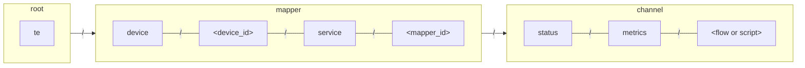

import ProposalBanner from '@site/src/components/ProposalBanner'

<ProposalBanner/>

## Concepts

Users can extend and adapt the built-in mappers for Cumulocity, Azure and AWS
with their own filtering and message transformation rules,
leveraging the core mapping rules and mapper mechanisms (bridge connections, HTTP proxies, operations).

As an example, users can now adapt to their use cases the translation of measurements from %%te%% JSON to Cumulocity JSON:
  - consuming measurements from a non-standard topic
  - filtering out part of the measurements
  - normalizing units
  - adding units read from device config
  - producing transformed measurements on a non-standard topic.

The behavior of a mapper is defined by a set of *connectors*, *flows*, *steps* and transformation *scripts*
which rule how to consume, transform and produce MQTT messages.

- A *step* function transforms one input message into zero, one or more output messages.
  - Steps are effect-free functions, with no access to MQTT, HTTP or the file-system.
  - The focus is on message transformation, format conversion, content extraction and completion as well as filtering and redacting.
- A *connector* is used by the mapper to consume messages from a source and produce messages to a sink.
  - Messages can be consumed from MQTT, files and background processes.
  - Transformed messages can be published over MQTT or appended to files.
- A *flow* applies a chain of transformation *steps* to input messages producing fully processed output messages.
  - The *flows* put things in motion, actually interacting with the system, consuming and producing messages.
  - Messages received on a flow are passed to the first step; and the transformed messages, if any,
    are pushed to the subsequent steps up to the output connector.
- A flow can combine builtin and user-provided steps.
  - Builtin steps provide generic building blocks such as %%te%% JSON translation into Cumulocity JSON.
  - Users can implement specific steps using JavaScript or TypeScript to refine transformations to their use cases. 
- If some message transformations can be fully defined only from the input message, most require a *context*.
  - What is the Cumulocity internal id of the device? What are the units used by a sensor? What is the location of the device?
  - For that purpose, %%te%% maintain a `context` object which is
    - passed to all invocations of transformation steps,
    - structured along 3 namespaces
      - `context.mapper` is shared by all the flows of a mapper
      - `context.flow` is private to the flow, shared by all the steps of that flow
      - `context.script` is private to a script instance and persisted across script reloads
    - created, cached and populated by %%te%% using configuration data,
    - possibly enriched by the flows with data extracted from metadata and capability messages,
    - used by all flows and steps to adapt their behavior
  - The `context` object also provides a `context.config` object
    - which content is specific to each script instance and provided by flows configuration
    - to set values such as thresholds, ranges, durations, units or endpoints
    - giving the users a way to control the behavior of a step without rewriting scripts.
- %%te%% provides some support to steps aggregating messages over time windows.
  - For each aggregating step, the mapper persists a state (a JSON object)
    which can be updated by the step function on each message and at regular intervals
    to produce transformed messages on time-window boundaries.

## Step API

A transformation *script* is a JavaScript or TypeScript module that exports:

- at least, a function `onMessage()`, aimed to transform one input message into zero, one or more output messages,
- possibly, a function `onInterval()`, called at regular intervals to produce aggregated messages,

```ts
interface FlowStep {
    // transform one input message into zero, one or more output messages
    onMessage(message: Message, context: Context): null | Message | Message[],
  
    // called at regular intervals to produce aggregated messages
    onInterval(time: Date, context: Context): null | Message | Message[]
}
```

A message has three attributes: a `topic`, a `payload` and a processing timestamp.

```ts
type Message = {
  topic: string,
  payload: Uint8Array,
  time: Date
}
```

:::note
The message `payload` is an array of unsigned bytes that has to be explicitly converted to a string when appropriate:

```js
const utf8 = new TextDecoder();

export function onMessage(message) {
    let string_payload = utf8.decode(message.payload)
    let json_payload = JSON.parse(string_payload)
    // ..
}
```
:::

A message can also contain protocol specific metadata (currently, only MQTT related metadata).
These metadata are set when the message is received from MQTT (flow input).
and used by the flow when the message is to be published over MQTT (flow output).

```ts
type Message = {
  topic: string,
  payload: Uint8Array,
  time: Date,
  mqtt?: MqttInfo
}

type MqttInfo = {
  qos?: 0 | 1 | 2,  // default is 1
  retain?: boolean  // default is false
}
```

### Context

The `context` object passed to `onMessage()` and `onInterval()` gives scripts and flows a way to share data.

```ts
type Context = {
  // A set of (key, value) pairs shared by all the scripts of a mapper
  mapper: KVStore,
  
  // A set of (key, value) pairs shared by all the scripts of a flow
  flow: KVStore,
  
  // A set of (key, value) pairs private to a script, persisted across module reloads
  script: KVStore,
  
  // A value provided by the flow configuration of that step
  config: any,
}

type KVStore = {
  // List the keys for which this store holds a value  
  keys(): string[]
  
  // Get the value attached to a key (returning null, if none)
  get(key: string): any,
  
  // Set the value attached to a key (removing the key if the provided value is null)
  set(key: string, value: any),
  
  // Remove any value attache to a key
  remove(key: string),
}
```

The `context.config` is an object freely defined by the step module, to provide default values such as thresholds, durations or units.

### Callbacks

The `onMessage` function is called for each message to be transformed
  - The arguments passed to the function are:
    - The message `{ topic: string, payload: Uint8Array, time: Date }`
    - A context object with the config and state
  - The function is expected to return zero, one or many transformed messages `[{ topic: string, payload: Uint8Array | string }]`
  - An exception can be thrown if the input message cannot be transformed.

A flow script can also export a `onInterval` function
  - This function is called at a regular pace with the current time and context.
  - The flow script can then return zero, one or many transformed messages
  - By sharing an internal state between the `onMessage` and `onInterval` functions,
    the flow script can implement aggregations over a time window.
    When messages are received they are pushed by the `onMessage` function into that state
    and the final outcome is extracted by the `onInterval` function at the end of the time window.

## Flow configuration

- The generic mapper loads flows and steps stored in `/etc/tedge/mappers/local/flows`.
- A flow is defined by a TOML file with `.toml` extension.
- A step is defined by a JavaScript file with an `.mjs` or `.js` extension.
  - This can also be a TypeScript module with a `.ts` extension.
- The definition of flow defines its input, output and error sink as well as a list of transformation steps.
- Each step is built either from a `script` or a `builtin` transformation
- A step can possibly be given a config (arbitrary json that will be passed to the transformation script)
- Configuration values can also be defined at the flow level,
  these values will be used as default configuration values by all the steps.
- The pace at which a step `onInterval` function is called defaults to one second,
  and can be configured `{ script = "my-script.js", interval = "60s", config = { .. } }`.

```toml
input.mqtt.topics = ["te/+/+/+/+/m/+"]

config = { format = "rfc3339" }

steps = [
    { builtin = "add-timestamp" },
    { script = "drop_stragglers.js", config = { max_delay = 60 } },
    { script = "te_to_c8y.js" }
]
```

### Transformation

The transformation applied by a step is defined either by
- a user-provided `script` implemented in JavaScript
- a builtin transformation provided by %%te%%.

### Input connectors

Messages can be consumed from MQTT, files and background processes.

An MQTT connector is simply defined by a list of MQTT topics

```toml
# A flow subscribing to all measurement values and meta-data
input.mqtt.topics = ["te/+/+/+/+/m/+", "te/+/+/+/+/m/+/meta"]
```

Messages can also be consumed from a file, each line being interpreted as the payload of a message
which topic is by default the file path.

```toml
# A flow consuming log entries
input.file.path = "/var/log/some-app.log"
```

By default, this file is followed as done by `tail -F`, waiting for new lines to be appended and consumed as messages.
This behavior can be changed, the file being then read at regular intervals.

```toml
[input.file]
path = "/var/log/some-app.log"
topic = "some-app-log"
interval = "1h"
```

Last but not least, messages can be consumed from a command output,
each line being wrapped into a message which topic is the command line or a configured topic name.

```toml
# A flow subscribing to journalctl entries for the agent
[input.process]
topic = "tedge-agent-journalctl"
command = "sudo journalctl --no-pager --follow --unit tedge-agent"
```

As for files, the command output can instead be consumed at regular intervals.

```toml
# A flow publishing new journalctl entries for the agent every hour 
[input.process]
topic = "tedge-agent-journalctl"
command = "journalctl --no-pager --cursor-file=/tmp/tedge-agent-cursor --unit tedge-agent"
interval = "1h"
```

### Output connectors

Transformed messages and errors can be published over MQTT or appended to files.

The default is to publish the transformed messages over MQTT on the topics specified by each message.
And to direct all the errors to a specific topic, the `te/error` topic.

```toml
[output.mqtt]

[errors.mqtt]
topic = "te/error"
```

These defaults can be overridden, by:
- assigning an MQTT topic to the messages (ignoring the topic assigned by the transformation steps)
- accepting only a set of topics (making sure the transformation steps are sending messages to these topics)
- redirecting transformations outcome to a file.

```toml
[output.mqtt]
accept_topics = "c8y/#"

[errors.file]
path = "/var/run/tedge/flows.log"
```

The output of flow can also be directed to the global context aka `context.mapper`.
The main usage is for a flow to store and share metadata received as retained MQTT messages,
so this metadata can be used by other transformation flows;
the canonical example being a context flow populating the context with measurement units to be used by a measurement publisher flow.

```toml
[output.context]
```

## %%te%% flow mapper

The extensible mapper is launched as a regular mapper:

```shell
tedge-mapper local
```

This mapper:

- loads all the flows defined in `/etc/tedge/mappers/local/flows`
- reloads any flow or script that is created, updated or deleted while the mapper is running
- subscribes to each flow `input.mqtt.topics`, dispatching the messages to the `onMessage` functions
- triggers at the configured pace the `onInterval` functions
- publishes memory usage statistics
- publishes flows and steps usage statistics

### Statistics

The memory and cpu statistics published by a mapper for its mapping rules, flows and steps are published over MQTT,
on a sub-topic of the mapper service topic.




For example, for the Cumulocity mapper:
```
te/device/main/service/tedge-mapper-c8y/status/metrics/measurements.toml
```

Statistics publishing is controlled by the following `tedge config` settings:

- `flows.stats.interval` The interval between statistics dumps (1 hour is the default)
- `flows.stats.on_message` Enable or disable statistics for step onMessage (false is the default)
- `flows.stats.on_interval`  Enable or disable statistics for step onInterval (false is the default).

## %%te%% flow cli

Flows and steps can be tested using the `tedge flows test` command.
- These tests are done without any interaction with MQTT and `tedge-mapper local`,
  meaning that tests can safely be run on a device in production
- By default, tests run against the flows and scripts used by `tedge-mapper local`.
  - However, a directory of flows under development can be provided using the `--flows-dir <FLOWS_DIR>` option.
  - One can also test flows of a builtin mapper using the `--mapper` and `--profile` options.
    The tests will then run against the flows of that mapper (and profile if any).
  - The subcommand `tedge flows config-dir` can be used to get the flows directory for a `--mapper` and a `--profile`.
- A test can be specific to a flow or script using the `--flow <OPTION>` option.
 
A test can be given a test message on the command line.

```shell
$ tedge flows test te/device/main///m/environment '{ "temperature": 29 }'

[c8y/measurement/measurements/create] {"type":"environment","temperature":{"temperature":29},"time":"2025-08-07T12:47:26.152Z"}
```

Alternatively a test can be given a sequence of messages via its stdin.

```shell
$ echo '[te/device/main///m/environment]' '{ "temperature": 29 }' | tedge flows test

[c8y/measurement/measurements/create] {"type":"environment","temperature":{"temperature":29},"time":"2025-08-07T12:47:26.152Z"}
```

__Note__ that when the input of a test is received from its stdin,
the topic is given using a bracket syntax `[<TOPIC>] <PAYLOAD>`
similar to the output of `tedge mqtt sub` and `tedge flows test` itself.

This can be used to chain tests:

```shell
$ tedge flows test collectd/mandarine/cpu/percent-active '1754571280.572:2.07156308851224' | tedge flows test

[c8y/measurement/measurements/create] {"type":"collectd","time":"2025-08-07T12:54:40.572Z","cpu":{"percent-active":2.07156308851224}}
```

## Builtin Objects

%%te%% flows uses the [QuickJS](https://bellard.org/quickjs/) engine and supports [ECMAScript® 2023](https://tc39.es/ecma262/2023/).

Flows and step functions are executed in a sandbox with no access to the system, the disk or the network.

The following builtin objects are exported:

- [`console.log()`](https://developer.mozilla.org/en-US/docs/Web/API/console/log_static)
  - Output log messages to the mapper log
- [`TextDecoder`](https://developer.mozilla.org/en-US/docs/Web/API/TextDecoder)
  - Only `utf-8` is supported 
- [`TextEncoder`](https://developer.mozilla.org/en-US/docs/Web/API/TextEncoder)

## Builtin transformations

### `add-timestamp`

Add a timestamp to JSON messages
- The `format` to be used is either `unix` (the default) or `rfc3339`.
- Unless specified otherwise the name for the added timestamp `property` is `time`.
- When the input message already has a timestamp property the default is to let it unchanged.
  This can be changed with the `reformat` config so any timestamp is reformated to the requested format. 
- `{ builtin = "add-timestamp", config = { format = "rfc3339", reformat = true }}`

### `ignore-topics`

Filter out messages with specific topics
- Must be configured with a list of `topics` and topic filters to be ignored
- `{ builtin = "ignore-topics", config.topics = ["te/device/main/service/mosquitto-c8y-bridge/#"] }`

### `limit-payload-size`

Filter out messages which payload is too large
- Must be configured with the `max_size` for the messages (maximum number of bytes)
- Can be configured to `discard` the messages instead of raising an error (the latter being the default)
- `{ builtin = "limit-payload-size", config = { max_size = 64000, discard = true }}`

### `set-topic`

Assign a target topic to messages
- Must be given the `topic` the messages have to be sent to.
- `{ builtin = "set-topic", config.topic = "c8y/measurement/measurements/create" }`

### `update-context`

Store a message in the [mapper context](#context) shared by all the flows and transformation steps.
- The message topic is used as the key and the message payload as the shared value.
  - The message payload is stored as is. It has to be a valid JSON payload, though
  - If the message payload is the empty string, then any previously stored value is removed from the context.
  - A transformation step can then get the value associated to a key from the mapper context
    - `const value = context.mapper.get(key)`
- An `update-context` step can be given a topic filter used to store only a subset of the messages.
  - `{ builtin = "update-context", config.topics = "te/+/+/+/+/m/+/meta" }`
  - If a message doesn't match the configured topic, this message is passed unchanged to the subsequent transformation steps.
