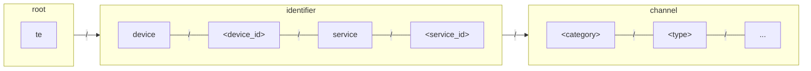
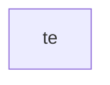
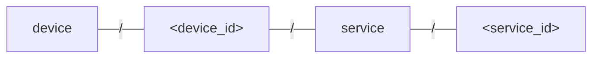
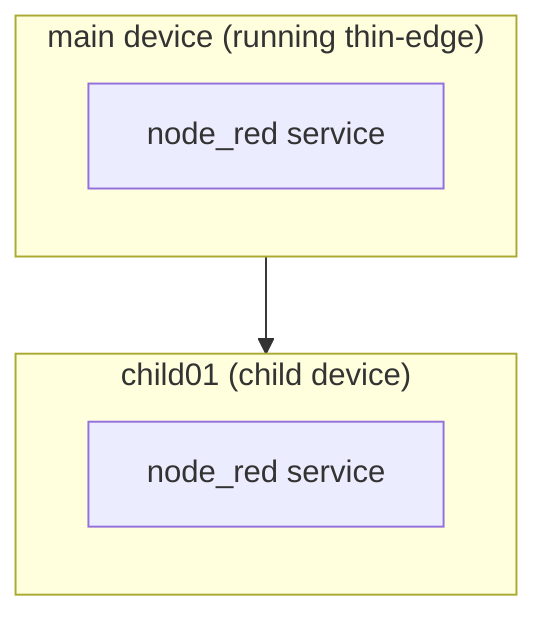
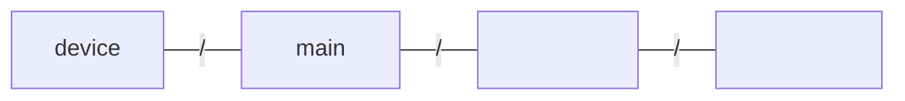
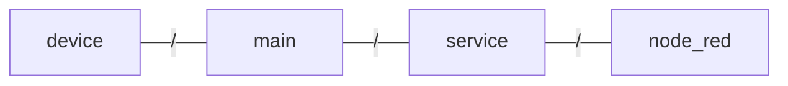
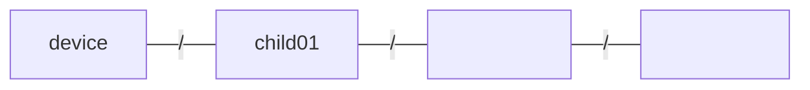
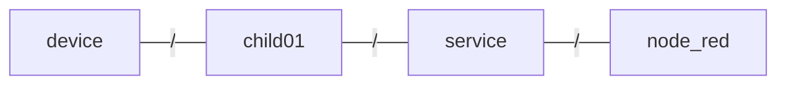
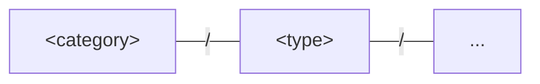
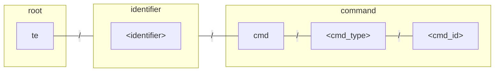

# Thin Edge MQTT API

## Topic Scheme

The thin-edge MQTT topic structure adopts a flexible and descriptive semantics, whilst keeping it consistent and predictable
to enable other clients/mappers to interact with the thin-edge components.

Whilst the topic structure is flexible, the document will focus on the typical use case.
Advanced use-cases can be viewed in the [advanced section](../contribute/design/mqtt-topic-design.md#using-custom-identifier-schemas),
but it is strongly encouraged to start out simple and only go to the advanced section if needed.

The MQTT topics are represented by three distinct groups; **root**, **identifier** and **channel**.
Each group contains one or more segments.

The typical topic structure is visualized in the following diagram.



Where the groups are described as follows:

|Group|Description|
|----|----|
|root|Base topic to group the identifier and channel under one common namespace|
|identifier|A descriptor which represents which device/service the channel data is related to|
|channel|Represents the information, such as telemetry data and commands, related to the **identifier**. Each channel type defines its own sub topic structure and corresponding payload format.|

The specifics of each group are detailed in the following sections.

### Root {#group-root}

The root/base topic prefix is used to group all data related to one thin-edge instance.
The root topic is used to avoid conflicts with other clients communicating on the same MQTT broker.

The convention is to use a fixed value of `te` (short for "thin-edge").

<p align="center">



</p>

### Identifier {#group-identifier}

The identifier group is made up of four segments.
Together these four segments reflect which device/service the channel information relates to.
Such channel data includes telemetry data and commands.

The identifier can be visually represented by the following diagram:

<p align="center">



</p>

Each segment is described as follows:

|Segment|Description|Required|
|--|--|--|
|device|A literal string, "device", indicating that the information is related to a device|Yes|
|&lt;device_id&gt;|id/name of the device. A value of `main` is used to represent the main device and any other value represents the device id of a child device. e.g. `child01`, `mycustomdevice`|Yes|
|service| A literal string, "service", indicating that the information is related to a service|No|
|&lt;service_id&gt;|Service id/name which the information is related to|No|

:::info
An empty segment value is used to represent "not applicable".
For instance publishing telemetry data of a device involves setting both the "service" and "service_id" segments to an empty string. See the [identifier-example](#identifier-example) for more details.
:::

#### Identifier Example

To help better understand how the **identifier** is used in the topics, let's image the following setup.
You have two devices; the main device and a single child device called "child01".
Both the main device (where thin-edge is running), and the child device have a single service called "node_red".
Thin-edge will build digital twins for the devices (main and child device),
and the "node_red" services associated with each of the devices.

The following diagram details the device hierarchy of the fictional setup.

<p align="center">



</p>

The diagram shows that there are two devices; the "main" device (the digital twin representation of thin-edge), and a child device called "child01".

The following table shows how the identifier is used to represent the different combination of devices and services, e.g. main device, node_red service running on the main device, child device and the node_red service running on the child device.

<table style={{width:'100%'}}>
<tr>
  <th>Entity</th>
  <th style={{width:'60%'}}>Structure</th>
  <th>Identifier topic prefix</th>
</tr>

<tr><td colspan="4"><strong>Main</strong></td></tr>

<!-- Main device -->
<tr>
  <td>Device</td>
  <td>



  </td>
  <td><code>te/device/main//</code></td>
</tr>

<!-- Main device service -->
<tr>
  <td>Service</td>
  <td>



  </td>
  <td><code>te/device/main/service/node_red</code></td>
</tr>

<tr><td colspan="4"></td></tr>
<tr><td colspan="4"><strong>Child ("child01")</strong></td></tr>

<!--  Child device -->
<tr>
  <td>Device</td>
  <td>



  </td>
  <td><code>te/device/child01//</code></td>
</tr>

<!-- Child device service -->
<tr>
  <td>Service</td>
  <td>



  </td>
  <td><code>te/device/child01/service/node_red</code></td>
</tr>
</table>


### Channel {#group-channel}

The channel group represents the information which is associated to the **identifier**.
Information includes both telemetry data (e.g. measurement, events and alarms) 
as well as commands which are used to execute actions on the device.

The channel group is represented by the following segments:

<p align="center">



</p>

The individual **categories** dictate the subsequent topic structure and payload schema, however the MQTT topic schema strives to keep some consistency amongst the different categories by applying similar concepts where possible.

|Segment|Description|
|-------|-----------|
|&lt;category&gt;|Category of data (telemetry or commands) which is related to the **identifier**. A fixed list of categories is used to represent data types such as; measurements, alarms, events, commands etc.|
|&lt;type&gt;|A unique type/name used to identify the information being pushed or received. Types allow users to filter/subscribe to data which interests them. For example, a measurement could be published under a type called "flow_rate", then other clients interested in the flow rate can subscribe to that single typed topic.|
|`...`|Additional channel specific topic segments. Each **category** is responsible for defining the number and meaning of the remaining topic segments.|


#### Categories

The following is an overview of the channel categories which are available.

|Category|Description|
|--------|-------|
|m|Measurements|
|e|Events|
|a|Alarms|
|cmd|Commands|


## Entity registration

Since thin-edge doesn't enforce what each entity identification level means,
an explicit registration is required to register every entity that is going to send data or receive commands.
For example, before a measurement can be sent from a service named `tedge-agent` from the device `rpi1001`,
the entity named `rpi1001` must be registered as a `device`,
and `tedge-agent` must be registered as a `service` linked to that device.

An entity can be registered with thin-edge by publishing a retained message to the entity identification topic prefix
with the entity type and other metadata that defines that entity.
To model the example mentioned above, if an entity identification topic scheme like the following is used:

```text
te/device/<device_id>/service/<service_id>
```

### Examples

Here are a few examples of how various entities can be registered.

#### Register a device

```sh te2mqtt
tedge mqtt pub -r 'te/device/main' '{
  "@type": "device",
  "type": "Gateway"
}'
```

Or the device can be registered using an explicit id:

```sh te2mqtt
tedge mqtt pub -r 'te/device/main' '{
  "@type": "device",
  "@id": "tedge001",
  "type": "Gateway"
}'
```

#### Register a service of the main device

```sh te2mqtt
tedge mqtt pub -r 'te/device/main/service/nodered' '{
  "@type": "service",
  "displayName": "nodered",
  "type": "systemd"
}'
```

The service is implicitly linked to the parent derived from the topic, `main` in this example.

But the parent can be explicitly provided as well with the `@parent` key,
if the parent can not be derived from the topic directly:

```sh te2mqtt
tedge mqtt pub -r 'te/component_namespace/service/nodered/instance-1' '{
  "@type": "service",
  "@parent": "te/device/main",
  "displayName": "nodered",
  "type": "systemd"
}'
```

#### Register a child device

```sh te2mqtt
tedge mqtt pub -r 'te/device/child01' '{
  "@type": "child-device",
  "displayName": "child01",
  "type": "SmartHomeHub"
}'
```

If the `@parent` info is not provided, it is assumed to be an immediate child of the main device.

#### Register a nested child device

Nested child devices are registered in a similar fashion as an immediate child device, however the registration message requires the additional `@parent` property to be set, indicating which parent the child device should be related to.

```sh te2mqtt
tedge mqtt pub -r 'te/device/nested_child01' '{
  "@type": "child-device",
  "@parent": "te/device/child01",
  "displayName": "nested_child01"
}'
```

#### Register a service of a child device

Service registration for child devices also follow the same rules as the main device,
where the `@parent` device info is derived from the topic itself, by default.
But, it is advised to declare it explicitly as follows:

```sh te2mqtt
tedge mqtt pub -r 'te/device/child01/service/nodered' '{
  "@type": "service",
  "@parent": "te/device/child01",
  "displayName": "nodered",
  "type": "systemd"
}'
```

#### Register a service of a nested child device

```sh te2mqtt
tedge mqtt pub -r 'te/device/nested_child01/service/nodered' '{
  "@type": "service",
  "@parent": "te/device/nested_child01",
  "displayName": "nodered",
  "type": "systemd"
}'
```

### Auto Registration

Users can use an auto-registration mechanism for immediate child devices and services,
if they conform to the following topic scheme that clearly demarcates the `device` and `service` in the topic itself:

```text
te/device/<device_id>/service/<service_id>
```

Where the second subtopic level is `device` and 4th level is `service`.

For example, if the following measurement message is received without any explicit registrations,

```text
te/device/rpi1001/service/collectd/m/cpu_usage
```

`rpi1001` and `collectd` will be auto-registered as `device` and `service` types.


In addition, the main device is associated with the following topic:

```text
te/device/main//
```

The main device topic follows the same topic schema but the `service` and `<service_id>` sections are left blank, whilst keeping the slash separators.

:::caution
Auto-registration of entities can be enabled/disabled via tedge configuration.

Users are highly encouraged to register the devices manually as it allows devices full control over their registration process. Meta information can also be added to the device to better describe the device's custom type and function.
:::

### Entity store

All the entity registration messages retained with the MQTT broker helps thin-edge components to
maintain an entity store with all the registered devices and services along with their metadata.

Components like mappers use such an entity store while processing data from various sources.
For example, a mapper component can get info about all the registered entities with a simple subscription
for all possible entity identification topic levels as follows:

```sh
mosquitto_sub -t 'te/+' -t 'te/+/+' -t 'te/+/+/+' -t 'te/+/+/+/+'
```

:::note
The MQTT broker is used as the persistence layer to store the registered entities (assuming the registration messages were published with the MQTT retain flag).
:::

## Data types

Telemetry and commands use the data type topic levels after the entity/component subtopics.
Even for the data type levels, a user is free to define those as they wish.
But thin-edge has some pre-defined `<data-type>` subtopics for well-known types like
*measurements*, *alarms*, *events* and *commands*, on which it enforces some constraints,
so that it can process them.

## Telemetry data

|Type|Topic scheme|
|------|-------|
|Measurements|`te/<identifier>/m/<measurement-type>`|
|Events|`te/<identifier>/e/<event-type>`|
|Alarms|`te/<identifier>/a/<alarm-type>`|

### Examples: With default device/service topic semantics

#### Publish to the main device

```sh te2mqtt
tedge mqtt pub -r 'te/device/main///m/environment' '{
  "temperature": 23.4
}'
```

If the there is no measurement type, then the type can be left empty, but it must have the trailing slash `/` (so that the number of topic segments is the same).

```sh te2mqtt
tedge mqtt pub -r 'te/device/main///m/' '{
  "temperature": 23.4
}'
```

#### Publish to a child device

```sh te2mqtt
tedge mqtt pub -r 'te/device/child01///m/environment' '{
  "temperature": 23.4
}'
```

#### Publish to a service on the main device

```sh te2mqtt
tedge mqtt pub -r 'te/device/main/service/nodered/m/environment' '{
  "temperature": 23.4
}'
```

Any MQTT client can subscribe to all measurements for all entities (devices and services) using the following MQTT topic:

```sh te2mqtt
tedge mqtt sub 'te/+/+/+/+/m/+'
```

If you want to be more specific and only subscribe to the main device, then you can used fixed topic names rather than wildcards:

```sh te2mqtt
tedge mqtt sub 'te/device/main/+/+/m/+'
```

Or to subscribe to a specific type of measurement published to an services on the main device, then use:

```sh te2mqtt
tedge mqtt sub 'te/device/main/service/+/m/memory'
```

#### Publish to a service on a child device

```sh te2mqtt
tedge mqtt pub -r 'te/device/child01/service/nodered/m/environment' '{
  "temperature": 23.4
}'
```

### Telemetry type metadata

The data types also may have additional metadata associated with it,
which can be added/updated by publishing to `/meta` subtopics of those data types.
For example, the units associated with measurements in the `battery_reading` measurement type
can be updated by publishing the following message:

```sh te2mqtt
tedge mqtt pub -r te/device/main///m/battery_reading/meta '{
  "units": {
    "temperature": "°C",
    "voltage": "V",
    "current": "A"
  }
}'
```

The metadata fields supported by each data type will be defined in detail later.

## Commands

The topic scheme for commands can be visualized using the diagram below. The **identifier** is used as the command 

<p align="center">



</p>

Where the command segments are describe as follows:

|Segment|Description|
|---|----|
|&lt;identifier&gt;|The [identifier](#group-identifier) (e.g. device/service) associated with the command.|
|&lt;cmd_type&gt;|Command type. Each command can define its own payload schema to allow commands to have parameters related to the command's function.|
|&lt;cmd_id&gt;|Unique command id which is unique for the command instance. e.g. `123456`, `d511a86cab95be81` etc.|

### Command examples

The following table details some example command types which are supported by thin-edge.

|Command Type|Example Topic|
|------|---|
|software_list|`te/<identifier>/cmd/software_list/<cmd_id>`|
|software_update|`te/<identifier>/cmd/software_update/<cmd_id>`|
|config_snapshot|`te/<identifier>/cmd/config_snapshot/<cmd_id>`|
|config_update|`te/<identifier>/cmd/config_update/<cmd_id>`|
|firmware_update|`te/<identifier>/cmd/firmware_update/<cmd_id>`|
|restart|`te/<identifier>/cmd/restart/<cmd_id>`|

The command would be interpreted differently based on the target entity.
For example, the `restart` could mean either a device restart or a service restart based on the target entity.

### Examples: With default device/service topic semantics

#### Command to main device

Command to fetch the software list from the main device:

```sh te2mqtt
tedge mqtt pub -r 'te/device/main///cmd/software_list/123' '{
  "status": "init"
}'
```

The `status` value will transition from `init` to the final `successful` or `failed` via many intermediate states
such as `validating`, `downloading`, `executing` etc.

The `status` field can even be skipped, which implies `init` status as follows:

```sh te2mqtt
tedge mqtt pub -r 'te/device/main///cmd/software_list/123' '{}'
```

#### Command to child device

Command to update the firmware of a child device:

```sh te2mqtt
tedge mqtt pub -r 'te/device/child01///cmd/firmware_update/123' '{
  "status": "init",
  "attempt": 1,
  "name": "OpenWRT",
  "version": "22.03",
  "url":"http://127.0.0.1:8000/tedge/file-transfer/tedge-child/firmware_update/93d50a297a8c235",
  "sha256":"c036cbb7553a909f8b8877d4461924307f27ecb66cff928eeeafd569c3887e29"
}'
```

#### Command to a service

Command to update the configuration of a service:

```sh te2mqtt
tedge mqtt pub -r 'te/device/main/service/collectd/cmd/config_update/123' '{
  "status": "init",
  "type": "collectd",
  "path": "/etc/collectd/collectd.conf",
  "url": "http://127.0.0.1:8000/tedge/file-transfer/collectd/config_update/collectd"
}'
```

### Commands metadata

For commands as well, additional command specific metadata can be registered as retained messages on the `<cmd_type>` topic.

For example, the supported configuration list of the main device can be declared as follows:

```sh te2mqtt
tedge mqtt pub -r te/device/main///cmd/config_snapshot '{
  "description": "Upload a configuration from the device",
  "supportedTypes": ["mosquitto", "tedge", "collectd"]
}'
```

## Health check

Services can publish their health status as follows:

```sh te2mqtt
tedge mqtt pub -r te/device/main/service/tedge-agent/status/health '{
  "pid": 1234,
  "status": "up",
  "time": 1674739912
}'
```

Services are responsible for updating their own health status by publishing to the above topic on any status changes. However, other clients can request the service to update its status by sending a health check command as shown below:

```sh te2mqtt
tedge mqtt pub -r te/device/main/service/tedge-agent/cmd/health/check '{}'
```

Services are also expected to react to device-wide health check commands as well (where service and `<service_id>` segments are left blank):

```sh te2mqtt
tedge mqtt pub -r te/device/main///cmd/health/check '{}'
```

On receipt of the above command, all services on that device should respond with their health status.

The services are also expected to register a `down` status Last Will and Testament (LWT) message with the broker
as follows so that the broker updates the health status when that service stops or crashes unexpectedly:

```sh te2mqtt
tedge mqtt pub -r te/device/main/service/tedge-agent/status/health '{
  "status": "down"
}'
```

## Backward compatibility for legacy tedge topics

A compatibility layer should be implemented to map the existing (legacy) tedge topics to the new topic structure.
Although the topics for *measurements*, *events* etc. can be mapped directly to the new scheme by just changing the topics,
certain types like *alarms*, which had severity in the topic in the old scheme must be mapped to the payload in the new scheme.
Even for *measurements* and *alarms*, the position of child device id in the topics are also different.
So, a compatibility mapper is essential during the transition phase from old scheme to new scheme.

It is important that the layer translate from the legacy to the new so that both existing and new entities/components are both observable via the new topics.

The compatibility layer would be deactivated via configuration after all entities/components have been migrated.

Below details some examples showing the mapping between the legacy and new topics:

### Telemetry: Main device

<table style={{width:'100%'}}>
<tr>
  <th>Type</th>
  <th>Topic</th>
  <th>Payload Changes</th>
</tr>

<!-- Measurements -->
<tr>
  <td>Measurements</td>
  <td>
    <p>Legacy</p>

```sh
tedge/measurements
```

  <p>New</p>

```sh
te/device/main///m/<type>
```

  </td>
  <td>
    No Change. If "&lt;type&gt;" is not provided, a default value of "ThinEdgeMeasurement" will be used.
  </td>
</tr>

<!-- Events -->
<tr>
  <td>Events</td>
  <td>
    <p>Legacy</p>

```sh
tedge/events/<type>
```

  <p>New</p>

```sh
te/device/main///e/<type>
```

  </td>
  <td>
    No Change
  </td>
</tr>

<!-- Alarms -->
<tr>
  <td>Alarms</td>
  <td>
    <p>Legacy</p>

```sh
tedge/alarms/<severity>/<type>
```

  <p>New</p>

```sh
te/device/main///a/<type>
```

  </td>
  <td>

The alarm severity should be set in the payload.

```json5
{
  "severity": "<severity>"
  // ...
}
```

  </td>
</tr>

</table>


### Telemetry: Child device

<table style={{width:'100%'}}>
<tr>
  <th>Type</th>
  <th>Topic</th>
  <th>Payload Changes</th>
</tr>

<!-- Measurements -->
<tr>
  <td>Measurements</td>
  <td>
    <p>Legacy</p>

```sh
tedge/measurements/<child_id>
```

  <p>New</p>

```sh
te/device/<child_id>///m/<type>
```

  </td>
  <td>
    No Change. If "&lt;type&gt;" is not provided, a default value of "ThinEdgeMeasurement" will be used.
  </td>
</tr>

<!-- Events -->
<tr>
  <td>Events</td>
  <td>
    <p>Legacy</p>

```sh
tedge/events/<type>/<child_id>
```

  <p>New</p>

```sh
te/device/<child_id>///e/<type>
```

  </td>
  <td>
    No Change
  </td>
</tr>

<!-- Alarms -->
<tr>
  <td>Alarms</td>
  <td>
    <p>Legacy</p>

```sh
tedge/alarms/<severity>/<type>/<child_id>
```

  <p>New</p>

```sh
te/device/<child_id>///a/<type>
```

  </td>
  <td>

The alarm severity should be set in the payload.

```json5
{
  "severity": "<severity>"
  // ...
}
```

  </td>
</tr>

</table>
