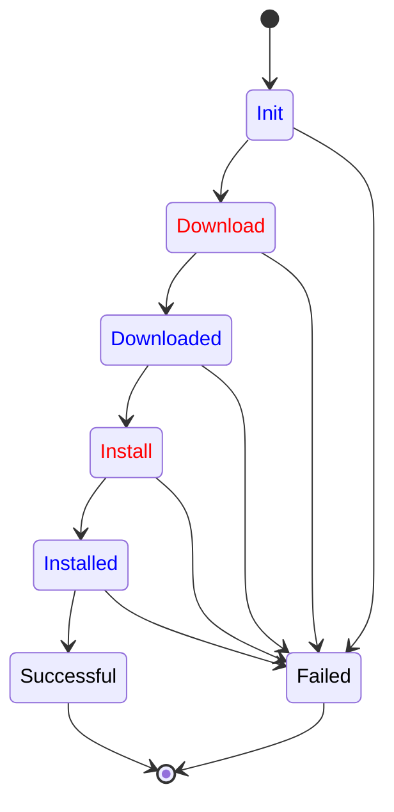

# Operation Workflows

Thin-edge provides the tools to define, extend and combine *operation workflows*
that rule the sequence of steps applied when a maintenance *operation* is triggered by an operator or some software component,
whether it is a *command* to restart the device, to update a configuration file or to install a new software.

An operation workflow defines the possible sequences of actions for an operation request
from its initialization up to its success or failure. It specifies the actions to perform
as well as any prerequisite checks, outcome validations and possible rollbacks.
However, a workflow doesn't define how to perform these actions.
These are delegated to software components participating in the operation progress.
More precisely, an operation workflow defines:
- the *observable states* of an ongoing operation instance
  from initialization up to a final success or failure
- the *participants* and their interactions, passing the baton to the software component
  whose responsibility is to advance the operation in a given state
  and to notify the other participants what is the new resulting state
- the *possible state sequences* so the system can detect any stale or misbehaving operation request.

These workflows are extensible. An agent developer can:
- override existing workflows by replacing the components responsible for certain steps with new ones
- implement new components to handle the specificities of some action such as domain-specific checks
- define new states and tell the system which software component will handle them: a script, a unix daemon, an external device
- introduce new transitions such as rollbacks or conditional executions
- create new workflows, combining other workflows and steps

## Operations, Capabilities, and Commands

From a user perspective an *operation* is a predefined sequence of actions
that an operator can trigger on a device to reach some desirable state.
It can be to restart the device or to install some new software.
From an implementation perspective, an operation is an API identified by a well-known name such as `restart` or `software_update`.
This API rules the coordination among the software components that need to interact to advance the operation.

Not all entities and components of a thin-edge device support all the operations,
and, even if they do, the implementations might be specific.
Installing a software package on top of service makes no sense.
Restarting the device is not the same as restarting one of its services.
Each entity or component has to declare its *capabilities* i.e. the operations made available on this target.

Strictly speaking, capabilities are not implemented nor declared by the devices and the services themselves.
They are implemented by thin-edge services and plugins.
These are the components which actually implement the operations interacting with the operating system and other software.
For instance, device restart and software updates are implemented by the `tedge-agent`.

Once an operation has been registered as a capability of some target entity or component,
an operator can trigger operation requests a.k.a *commands*,
for this kind of operation on this target,
say to request a software update than a restart of the device.

## MQTT Topics

Operations, capabilities and commands are declared, triggered and managed using MQTT topics,
all built along the same schema, matching the topic filter `te/+/+/+/+/cmd/+/+`,
with a target prefix `te/+/+/+/+` and a command specific suffix `/cmd/+/+`:

| root   | target           | command keyword | operation name | command instance id |
|--------|------------------|-----------------|----------------|---------------------|
| __te__ | /*a*/*b*/*c*/*d* | /__cmd__        | /*operation*   | /*command-id*       |

The prefix __te__/*a*/*b*/*c*/*d* uniquely identifies the entity or component that is the target of commands.
It can be:
- the main device: `te/device/main//`
- a child device: `te/device/child-xyz//`
- a service: `te/device/main/service/tedge-agent`
- or any application specific entity identifier such as `te/raspberry-pi/123/process/collectd`.

The longer prefix __te__/*a*/*b*/*c*/*d*/__cmd__ groups all the capabilities and commands
related to the entity identified by __te__/*a*/*b*/*c*/*d*.

### Capabilities

A capability, the ability for an entity __te__/*a*/*b*/*c*/*d* to handle a given *operation*, is published as a retained message
on the topic __te__/*a*/*b*/*c*/*d*/__cmd__/*operation*, in which the suffix is the well-known name of the operation.

One can subscribe to the following topic to get all the capabilities of a thin-edge device and its child-devices and services.

```sh te2mqtt
tedge mqtt sub 'te/+/+/+/+/cmd/+' 
```

The retained messages published on these topics are operation specific and defined by the operation APIs.
They provide operation specific parameters such as the list of software package types that can be installed,
or the list of file types that configured.

As an example, the `tedge-agent` which implements the `restart` and `software_update` capabilities for the main device,
will emit two retained messages.

A first message to tell that the main device can be restarted:

```sh te2mqtt
tedge mqtt pub -r 'te/device/main///cmd/restart' '{}' 
```

A second one to tell that debian packages can be installed on the main device: 

```sh te2mqtt
tedge mqtt pub -r 'te/device/main///cmd/software_update' '{ "type": ["apt"] }' 
```

### Commands

The topics matching __te__/*a*/*b*/*c*/*d*/__cmd__/*operation*/*command-id* are used to trigger and manage commands,
i.e. operation requests on a specific target for a specific *operation*.

Each request is given a unique command identifier.
Combined with the target identifier and the operation name this defines a request specific topic
where the current state of the command workflow is published as a retained message.
This unique id assigned by the requester, who is also responsible for creating the topic
with an initial state and for finally removing it.

As an example, software update is an operation that requires coordination between a mapper and `tedge-agent`.
On reception of a software update request from the cloud operator,
the `tedge-mapper` creates a fresh new topic for this command,
say `te/device/main///cmd/software_update/c8y-mapper-123` for the 123<sup>rd</sup> request.
On this topic, a first retained messages is published to describe the operator expectations for the software updates.

```sh te2mqtt
tedge mqtt pub -r 'te/device/main///cmd/software_update/c8y-mapper-123' '{
    "status": "init",
    "modules": [
        {
            "type": "apt",
            "name": "collectd",
            "version": "5.7",
            "action": "install"
        }
    ]
}' 
```

Then, the `tedge-agent` and possibly other software components take in charge the command,
making it advance to some final state,
publishing all the successive states as retained messages on the command topic.

Eventually, the `tedge-mapper` will have to clean the command topic with an empty retained message: 

```sh te2mqtt
tedge mqtt pub -r 'te/device/main///cmd/software_update/c8y-mapper-123' ''
```

## MQTT-Driven Workflows

Operations that require coordination among several software components are managed using *MQTT-driven workflows*.

The core idea is to expose over MQTT the different states a specific operation request might go through;
so independent sub-systems can observe the progress of the request and act accordingly to their role.

- A specific topic is attached to each command under-execution.
  - This topic is specific to the target of the command, the requested operation and the request instance.
  - e.g. `te/device/child-xyz///cmd/configuration-update/req-123`
- The messages published over this topic represent the current state of the command.
  - Each message indicates at which step of its progression the command is and gives all the required information to proceed.
  - e.g. `{ "status": "Requested", "target": "mosquitto", "url": "https://..." }`
- The state messages are published as retained.
  - They capture the latest state of the operation request.
  - Till some change occurs, this latest state is dispatched to any participant on reconnect.
- Several participants act in concert to move forward the command execution.
  - The participants observe the progress of all the operations they are interested in.
  - They watch for the specific states they are responsible in moving forward.
  - When a step is performed, successfully or not, the new state is published accordingly by the performer.

### Example

Here is an example where three software components participate in a `configuration-update` command.
- The `tedge-mapper` creates the initial state of the command
  providing the required information to install a new version for a configuration file;
  and then waits for the final outcome (in black).
- The `tedge-config-plugin` handles the main steps (in red): downloading the file and installing it where expected.
- User-provided scripts handle domain-specific checks (in blue)
  to timely schedule the command as well as to ensure the configuration file is not corrupted and properly installed.



### Benefits

Observe on the example that:

- At any state, *one and only one* participant is responsible to move the operation forward.
- Publishing a state to the MQTT command topic, can be seen as passing the baton from one participant to another.
  The mapper creates the `Init` state and then lets the other components work.
  The plugin tell the download has been successful by publishing the `Downloaded` state,
  but do nothing till the domain-specific component has checked the file and move the command state to `Install`.
- Each software component has to know only *some* states of the whole workflow:
  - the states they are responsible for
  - the states they create to pass the control.
- The compatibility of two participants, one publishing the state owned by the other, is only defined by the message payload:
  - all the property fields, required to make progress at some state, must be provided by the previous participant.

The benefits are that:
- A participant can be substituted by another implementation as long as the substitute implementation
  is ready to process at least all the state processed by the former implementation.
  - This is the key principle used by thin-edge to provide extensible operation support.
  - The `tedge-configuration-plugin` defines the `Init`, `Downloaded`, `Installed` states
    with no specific behavior beyond proceeding to the next step;
    so, a domain specific component can be substituted to add extra checks and actions before moving forward.
- Extra states and participants can be added as long as each state is owned by one participant.
  - For instance, an agent developer can introduce a `Rollback` state in the `configuration-update` workflow,
    associated by another software component responsible for these rollbacks.

Furthermore, specific versions of the same workflow can be defined on different targets.
Indeed, all the status updates for a command on a given thin-edge entity or component
are published on an MQTT topic which prefix is the entity identifier.
- The same executable can be used to handle operations on different targets.
  For instance, the `tedge-configuration-plugin` can run on the main device `te/device/main//`
  as well as on a child-device identified by `te/device/child-xyz//`.
- A specific executable can be substituted on a specific target.
  If for some reasons, `tedge-configuration-plugin` cannot be installed on a child-device,
  then a specific implementation of the `configuration-update` MQTT API can be used to serve configuration updates
  on, say, `te/micro-controller/xyz//`.
- A workflow can be extended differently for each target.
  As an example, an agent developer can define an extra rollback state on the main device but not on the child devices.

### Operation API

As several software components have to collaborate when executing a command, each operation must define a specific API.
This API should be based on the principles of MQTT-driven workflow and defines:
- the well-known operation name such `restart` or `software-update`
- user documentation of the required input and the expected outcome of an operation request
- the set of observable states for a command and the possible state sequences
- for each state:
  - the well-known name such as `Download` or `Downloaded`
  - the schema of the state payload and the required parameters to process a command at this stage
  - developer documentation on the role of each parameter and the expected checks and actions
- the schema for the capability message sent when the operation is enabled on some thin-edge entity or component
  - developer documentation on the role of each field of the capability message

A workflow implementation is free to define the states a command can go through
as well as the message payload attached to each state.

However, there are some rules and best practices.

- Three states are mandatory: `Init`, `Successful` and `Failed`.
- `Init` must be the unique initial state of the workflow.
  - This state must give all the information required to execute the command.
  - Having no other initial states is important so any command requester (as the mapper)
    can trigger commands in a systematic manner *even* if the workflow is updated.
- `Successful` and `Failed` must be the unique terminal states of the workflow.
  - The payload of the `Failed` state should contain a `reason` property telling what failed.
  - Having no other terminal states is important so any command requester (as the mapper)
    can await the termination of a command in a systematic manner *even* if the workflow is updated.
- A workflow API should define *no-op* states with no pre-defined actions
  and which sole purpose is to give an agent developer the opportunity to *insert* its own logic and extra steps.
  - A *no-op* state is a state which has a single direct transition to the next state.
  - As an example, having a `Downloaded` *no-op* state, with a direct transition to an `Install` state which uses the downloaded file,
    let an agent operator override the automatic transition, say to check the downloaded file *before* moving the `Install` state.
  - The `Init` state should be a *no-op* state.

### Operation Implementation

A workflow implementation for a specific operation must implement the actions specified for each non *no-op* state.
This implementation has some freedom, notably to implement extra checks and actions but also to add new states.

However, there are some rules and best practices.

- All the state messages must be published as retained with QoS 1.
- A workflow implementation should not reject a state message payload with unknown fields.
  - It's also important to keep these unknown fields in the following states.
  - This is important as we want to *extend* the workflow of an operation.
    A software component added by the user might need these *extra* fields the plugin is not aware of.
- A workflow implementation must not react on *no-op* states nor terminal states.
  - The transition from a *no-op* state must be handled either by thin-edge as direct transition
    or overridden by the user with domain-specific checks and actions.
  - The terminal states, a.k.a `Successful` and `Failed`, are owned by the process which created the `Init` state (in practice, the mapper).
    Only this process should clear the retained message state for an operation instance by sending an empty payload on command's topic.

### Workflow Overriding

Thin-edge provides a mechanism to override, extend and combine workflows.

This mechanism is provided by the `tedge-agent` which gather a set of user-defined workflows
and combined them with the builtin workflows implemented by the agent itself and the thin-edge operation plugins.

Each workflow is defined using a TOML file that specifies:
- the operation target and name defined as a topic filter
  such as `te/device/main///cmd/software-update/+` or `te/device/main/service/+/cmd/restart/+`
- the list of states
- for each state:
  - the state name as defined by the operation API
  - the name of the state owner which is the process that is responsible for advancing a command at this state
    (the default being `tedge`, meaning that thin-edge is responsible for running the state checks and actions)
  - the set of states which can be an outcome for this state actions
  - possible extra instructions on how to process the command at this stage, e.g.
    - run a script
    - emit an event
    - raise an alarm

```toml title="file: workflow-example.toml"
target = "te/device/main///cmd/configuration-update/+"

[Init]
  next = ["Download", "Failed"]
  script = "/bin/schedule-configuration-update.sh"
    
[Download]
  owner = "tedge-configuration-plugin"
  next = ["Downloaded", "Failed"]

[Downloaded]
  script = "/bin/check-configuration-file.sh"
  next = ["Install", "Failed"]

[Install]
  owner = "tedge-configuration-plugin"
  next = ["Installed", "Failed"]
        
[Installed]
  script = "/bin/check-configuration-update.sh"
  next = ["Successful", "Failed"]

[Successful]
  event = "te/device/main///e/operations"
  next = []
  
[Failed]
  alarm = "te/device/main///a/operations"
  next = []
```

Thin-edge combines all these workflows to determine what has to be done
when a state message is published for a command on one topic matching the global topic filter for commands,
i.e. `te/+/+/+/+/cmd/+/+`. Given an actual command state message, thin-edge
- keeps only the workflows which target topic filter matches the topic of the message
- then keeps only the workflows that define a behavior for the state of the message payload
- and then uses priority rules to select a single workflow: the workflow ruling this command at that stage

The priority rules give a higher priority to the workflow that are user-defined than to those pre-defined by thin-edge.
If several user-defined workflows are matching a command state,
then the alphabetic order of the workflow definition file names is used:
`001-configuration-update.toml` being of higher priority than `002-configuration-update.toml`.

