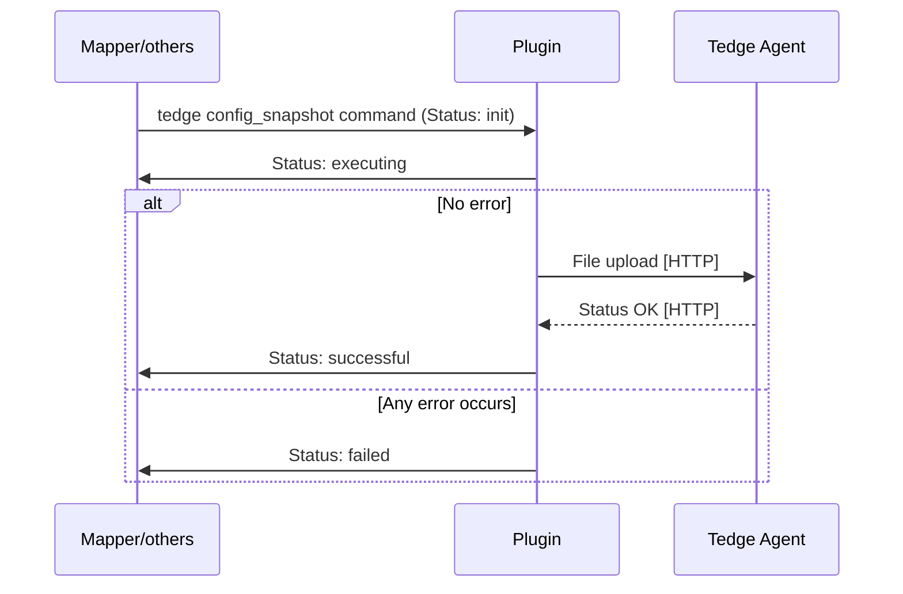
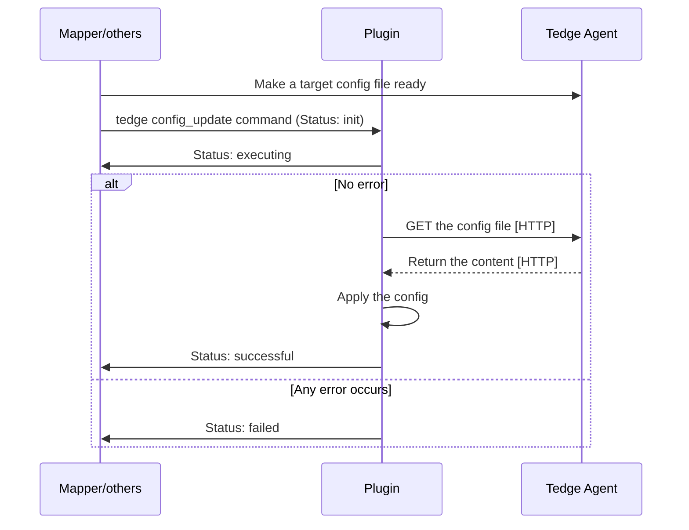

# Configuration Management Plugin

Thin-edge provides an operation plugin to manage device configuration files.

* This management is bi-directional:
  * A device can be taken as reference,
    all the managed files being uploaded to the [tedge file transfer repository](tedge-file-transfer-service.md)
    and stored there as a configuration snapshot.
  * A configuration update can be pushed from the tedge file transfer repository to any devices of the same type,
    i.e. supporting the same kind of configuration files.
  * This plugin, combined with a cloud mapper, enables configuration management from the cloud.
* With this operation plugin, the device owner defines the list of files
  (usually configuration files, but not necessarily).
* The plugin configuration itself can be managed both locally and from the cloud,
  meaning, the device owner can update from the cloud the list of files to be managed with the combination of the cloud mapper.
* The configuration files are managed according to their type,
  a name that is chosen by the device owner to categorise each configuration.
  By default, the full path of a configuration file on the device is used as its type.
* When files are downloaded from the tedge file transfer repository to the device where the plugin is installed,
  __these files are stored in the target path with a temporary name first__.
  They are atomically renamed, only after a fully successful download.
  The aim is to avoid breaking the system with half downloaded files.
* When a downloaded file is copied to its target, the unix user, group and mod are preserved.
* Once an update has been downloaded from the tedge file transfer repository to the target device,
  __the plugin publishes an operation status update message on the local thin-edge MQTT bus__.
  The device software has to subscribe to these messages if any action is required,
  say to check the content of file, to pre-process it or to restart a daemon.
* The configuration plugin can be installed both on the main thin-edge device and the child-device.
* The plugin has a dependency on the `tedge.toml` configuration file to get the MQTT hostname, port, and device identifier.

In summary, the responsibilities of the plugin are:
  * to define the list of files under configuration management,
  * to notify the local MQTT bus when this list is updated,
  * to upload these files to the tedge file transfer repository on demand,
  * to download the files pushed from the tedge file transfer repository,
  * to make sure that the target files are updated atomically after successful download,
  * to notify the device software when the configuration is updated.

By contrast, the plugin is not responsible for:
  * checking the uploaded files are well-formed,
  * restarting the configured processes,
  * establishing any direct connection to clouds.

A user-specific component, installed on the device,
  can implement more sophisticated configuration use-cases by:
  * listening for configuration updates on the local thin-edge MQTT bus,
  * restarting the appropriate processes when appropriate,
  * declaring intermediate files as the managed files,
    to have the opportunity to check or update their content
    before moving them to the actual targets.

## Installation

As part of this plugin installation:
* On systemd-enabled devices, the service definition file for this plugin is also installed.

Once installed, the `tedge-configuration-plugin` runs as a daemon on the device,
listening to configuration snapshot commands on the `<root>/<identifier>/cmd/config_snapshot/+` [MQTT topic](mqtt-api.md#command-examples) 
and to configuration update commands on the `<root>/<identifier>/cmd/config_update/+` [MQTT topic](mqtt-api.md#command-examples).

## Configuration

The `c8y-configuration-plugin` configuration is stored by default under `/etc/tedge/plugins/tedge-configuration-plugin.toml`

This [TOML](https://toml.io/en/) file defines the list of files to be managed by the plugin.
Each configuration file is defined by a record with:
* The full `path` to the file.
* An optional configuration `type`. If not provided, the `path` is used as `type`.
  This `type` is used to declare the supported configuration file and then to trigger operations on that file.
  All the configuration `type`s are declared as the supported config list to the local MQTT bus on start
  and on change of the `plugins/tedge-configuration-plugin.toml` file.
* Optional unix file ownership: `user`, `group` and octal `mode`.
  These are only used when a configuration file pushed via a `config_update` command doesn't exist on the device,
  and a new one is created with these ownership parameters.
  When a configuration file is already present on the device,
  this plugin preserves its existing ownership, ignoring these parameters.

```toml title="file: /etc/tedge/plugins/tedge-configuration-plugin.toml"
files = [
  { path = '/etc/tedge/tedge.toml', type = 'tedge.toml' },
  { path = '/etc/tedge/mosquitto-conf/c8y-bridge.conf', type = 'c8y-bridge' },
  { path = '/etc/tedge/mosquitto-conf/tedge-mosquitto.conf', type = 'tedge-mosquotto' },
  { path = '/etc/mosquitto/mosquitto.conf', type = 'mosquitto', user = 'mosquitto', group = 'mosquitto', mode = 0o644 }
]
```

On start and whenever this file is updated, the configuration plugin sends
the supported config types declaration message with a retained flag
to the `config_snapshot`` and `config_update`` command topics
with the set of `type`s listed in that configuration file
(implicitly adding the `tedge-configuration-plugin` type also to that set).
The message can be observed over the MQTT bus of the thin-edge device.

Given that `root.topic` and `device.topic` are set to `te` and `device/main//` for the main device,
the message to declare the supported configuration types is as follows.

```sh te2mqtt
tedge mqtt pub -r 'te/device/main///cmd/config_snapshot' '{
  "types": ["tedge-configuration-plugin", "tedge.toml", "/etc/tedge/mosquitto-conf/c8y-bridge.conf", "/etc/tedge/mosquitto-conf/tedge-mosquitto.conf", "mosquitto"]
}'
```

```sh te2mqtt
tedge mqtt pub -r 'te/device/main///cmd/config_update' '{
  "types": ["tedge-configuration-plugin", "tedge.toml", "/etc/tedge/mosquitto-conf/c8y-bridge.conf", "/etc/tedge/mosquitto-conf/tedge-mosquitto.conf", "mosquitto"]
}'
```

:::note
* The file `/etc/tedge/plugins/tedge-configuration-plugin.toml` itself doesn't need to be listed.
  This is implied, so the list can *always* be configured from the configuration plugin.
  The `type` for this self configuration file is `tedge-configuration-plugin`.
* If the file `/etc/tedge/plugins/tedge-configuration-plugin.toml`
  is not found, empty, ill-formed or not-readable
  then only `tedge-configuration-plugin.toml` is declared as a supported configuration type.
:::
  
The behavior of the `tedge-configuration-plugin` is also controlled
by the configuration of thin-edge:

* `tedge config get mqtt.bind.address`: the address of the local MQTT bus.
* `tedge config get mqtt.bind.port`: the TCP port of the local MQTT bus.
* `tedge config get root.topic`: the root of the [MQTT topic scheme](mqtt-api.md) to publish and subscribe.
* `tedge config get device.topic`: the identifier of the [MQTT topic scheme](mqtt-api.md) to publish and subscribe.

## Notifications (Do we need it? Read my opinion at the bottom of the file.)

**Just copied from c8y-configuration-plugin spec**

When a configuration file is successfully downloaded from the tedge file transfer repository,
the `tedge-configuration-plugin` service notifies this update over MQTT.

* The notification messages are published on the topic `tedge/configuration_change/{type}`,
  where `{type}` is the type of the configuration file that have been updated,
  for instance `tedge/configuration_change/tedge.toml`
* Each message provides the path to the freshly updated file as in `{ "path": "/etc/tedge/tedge.toml" }`.

:::note
* If no specific type has been assigned to a configuration file, then the path to this file is used as its type.
  Update notifications for that file are then published on the topic `tedge/configuration_change/{path}`,
  for instance `tedge/configuration_change//etc/tedge/mosquitto-conf/c8y-bridge.conf`.
* Since the type of configuration file is used as an MQTT topic name, the characters `#` and `+` cannot be used in a type name.
  If such a character is used in a type name (or in the path of a configuration file without explicit type),
  then the whole plugin configuration `/etc/tedge/c8y/c8y-configuration-plugin.toml` is considered ill-formed.
:::

## Handling config snapshot commands

By a config snapshot operation, the plugin uploads a requested configuration file to the tedge file transfer repository.

The plugin subscribes to config snapshot commands on the `<root>/<identifier>/cmd/config_snapshot/+` MQTT topics.
For example, it subscribes to the following topic for the main device.

```sh te2mqtt
tedge mqtt sub 'te/device/main///cmd/config_snapshot/+'
```

A new config snapshot command with the ID "1234" is published by another component as below.

```sh te2mqtt
tedge mqtt pub -r 'te/device/main///cmd/config_snapshot/1234' '{
  "status": "init",
  "tedgeUrl": "http://127.0.0.1:8000/tedge/file-transfer/main/config_snapshot/mosquitto-1234",
  "type": "mosquitto"
}'
```

On reception of a configuration snapshot command, the plugin:
   1. Uses the `type`(`mosquitto`) information to look up the target path from `tedge-configuration-plugin.toml` file,
   and retrieves the requested configuration content from the corresponding `path`(`/etc/mosquitto/mosquitto.conf`).
   2. `PUT`s the content to the `tedgeUrl` specified by the command's payload.

During the process, the plugin updates the command status via MQTT
by publishing a retained message to the same `<root>/<identifier>/cmd/config_snapshot/<id>` topic,
where the command is received.
The payload contains all the received data plus `path` information.

On the reception of a new config snapshot command, the plugin updates the status to `executing`.
After successfully uploading the file to the file transfer repository, the plugin updates the status to `successful`.
If any unexpected error occurs, the plugin updates the status to `failed` with a `reason`.

Thus, the operation status update message for the above example looks like below.

```sh te2mqtt
tedge mqtt pub -r 'te/device/main///cmd/config_snapshot/1234' '{
  "status": "successful",
  "tedgeUrl": "http://127.0.0.1:8000/tedge/file-transfer/main/config_snapshot/mosquitto-1234",
  "type": "mosquitto",
  "path": "/etc/mosquitto/mosquitto.conf"
}'
```

### Flow



## Handling config update commands

By a config update operation, the plugin downloads a requested configuration file from the tedge file transfer repository,
and moves it to the target path.

The plugin subscribes to config update commands on the `<root>/<identifier>/cmd/config_update/+` MQTT topics.
For example, it subscribes to the following topic for the main device.

```sh te2mqtt
tedge mqtt sub 'te/device/main///cmd/config_update/+'
```

A new config snapshot command with the ID "1234" is published by another component as below.

```sh te2mqtt
tedge mqtt pub -r 'te/device/main///cmd/config_update/1234' '{
  "status": "init",
  "tedgeUrl": "http://127.0.0.1:8000/tedge/file-transfer/main/config_update/mosquitto-1234",
  "remoteUrl": "http://www.my.url",
  "type": "mosquitto"
}'
```

On reception of a configuration update command, the plugin:
   1. `GET`s the content from the `tedgeUrl` specified by the command.
   2. Uses the `type`(`mosquitto`) information to to look up the target path from `tedge-configuration-plugin.toml` file,
   and applies the new configuration content to the corresponding `path`(`/etc/mosquitto/mosquitto.conf`).

During the process, the plugin updates the command status via MQTT
by publishing a retained message to the same `<root>/<identifier>/cmd/config_update/<id>` topic,
where the command is received.
The payload contains all the received data plus `path` information.

On the reception of a new config update command, the plugin updates the status to `executing`.
After all operation steps are successfully completed, the plugin updates the status to `successful`.
If any unexpected error occurs, the plugin updates the status to `failed` with a `reason`.

Thus, the operation status update message for the above example looks like below.

```sh te2mqtt
tedge mqtt pub -r 'te/device/main///cmd/config_update/1234' '{
  "status": "successful",
  "tedgeUrl": "http://127.0.0.1:8000/tedge/file-transfer/main/config_update/mosquitto-1234",
  "remoteUrl": "http://www.my.url",
  "type": "mosquitto",
  "path": "/etc/mosquitto/mosquitto.conf"
}'
```

### Flow



## Usage

```sh
tedge-configuration-plugin --help
```

```run command="tedge-configuration-plugin --help" lang="text" title="Output"
Thin-edge device configuration manager

USAGE:
    tedge-configuration-plugin [OPTIONS]

OPTIONS:
        --config-dir <CONFIG_DIR>
            [default: /etc/tedge]

        --debug
            Turn-on the debug log level.

            If off only reports ERROR, WARN, and INFO If on also reports DEBUG and TRACE

    -h, --help
            Print help information

    -V, --version
            Print version information

On start, `tedge-configuration-plugin` notifies of its managed configuration files and
sends this list via MQTT.
`tedge-configuration-plugin` subscribes to the topics for the commands `config_snapshot`
and `config_update`.

The thin-edge `CONFIG_DIR` is used:
  * to find the `tedge.toml` where the following configs are defined:
    ** `mqtt.bind.address` and `mqtt.bind.port` to connect to the tedge MQTT broker
    ** `root.topic` and `device.topic`: for the MQTT topics to publish to and subscribe from
  * to find/store the `tedge-configuration-plugin.toml`: the plugin configuration file
```

## Logging

The `tedge-configuration-plugin` reports progress and errors on its `stderr`.
