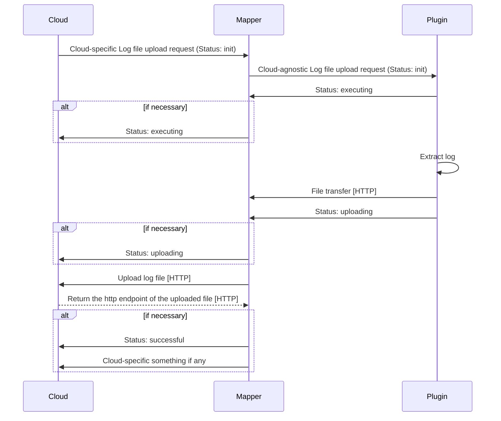
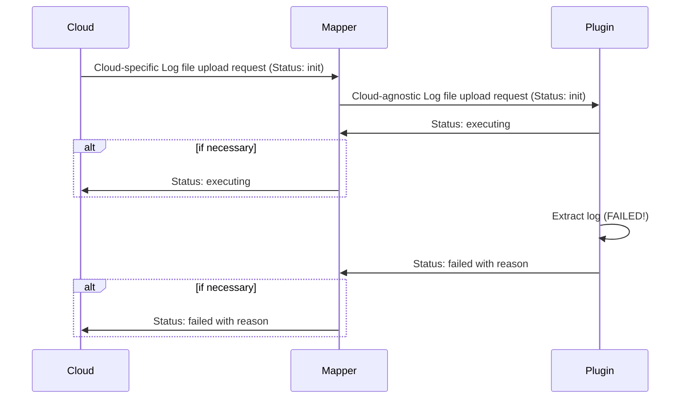
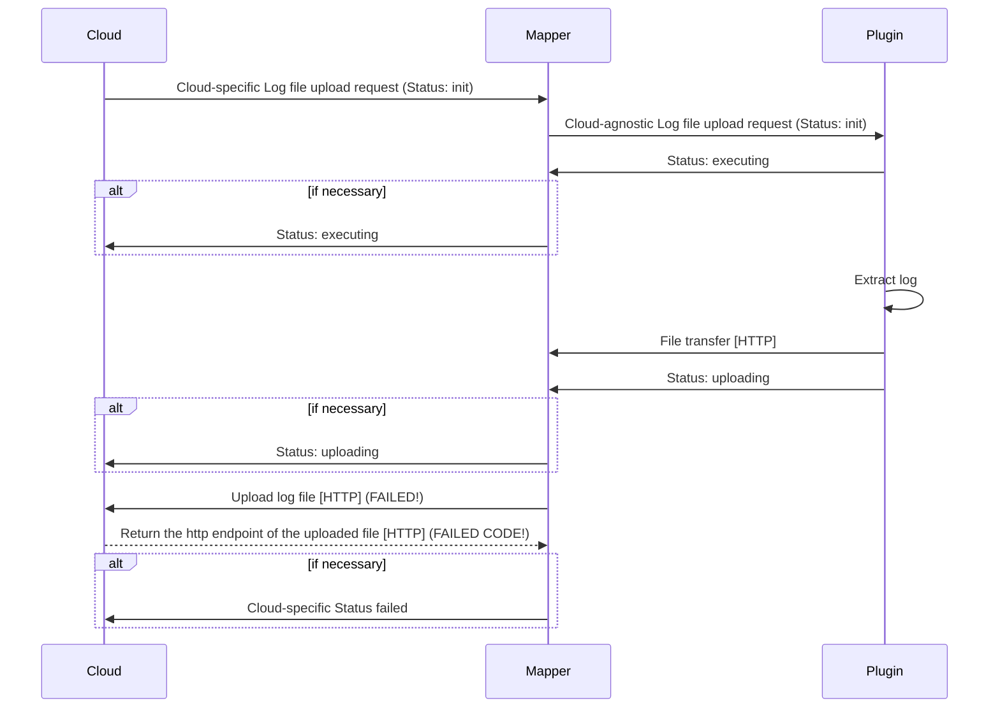

# Log file management from cloud

Thin-edge provides an operation plugin to fetch log files from the device on to cloud.

* Log file management from cloud is provided with a `tedge-log-plugin` which runs as a daemon on thin-edge together with cloud mapper.
* The device owner can define the list of log files that can be retrieved from cloud,
  in the plugin's configuration file named `tedge-log-plugin.toml`.
* Each entry in the the `tedge-log-plugin.toml` file contains a log `type` and a `path` pattern,
  where the `type` is used to represent the logical group of log files matching the `path` pattern.
* On receipt of a log file request for a given `type`, 
  the log files for that type are retrieved using the `path` pattern defined in this `tedge-log-plugin.toml`,
  matched against the requested time range, search text and maximum line count.
* The list of managed log files in `tedge-log-plugin.toml` can be updated both locally as well as from cloud, for instance,
  using the configuration management feature of Cumulocity, combined with the `tedge-configuration-plugin` of thin-edge.

## Installation

As part of this plugin installation:
* On systemd enabled devices, the service definition file for this `tedge-log-plugin` daemon is also installed as part of this plugin installation.

Once installed, the `tedge-log-plugin` is run as a daemon on the device listening to log requests from cloud mapper on `te/device/main///cmd/log_upload/+` MQTT topic.

## Configuration

The `tedge-log-plugin` configuration is stored by default under `/etc/tedge/plugins/tedge-log-plugin.toml`.

This [TOML](https://toml.io/en/) file defines the list of log files that can be retrieved from the cloud tenant.
The paths to these files can be represented using [glob](https://en.wikipedia.org/wiki/Glob_(programming)) patterns.
The `type` given to these paths are used as the log type associated to a log path.

```toml title="file: /etc/tedge/plugins/tedge-log-plugin.toml"
files = [
  { type = "mosquitto", path = '/var/log/mosquitto/mosquitto.log' },
  { type = "software-management", path = '/var/log/tedge/agent/software-*' },
  { type = "c8y_CustomOperation", path = '/var/log/tedge/agent/c8y_CustomOperation/*' }
]
```

The `tedge-log-plugin` parses this configuration file on startup for all the `type` values specified,
and sends the supported log types message to MQTT local broker on `te/device/main///cmd/log_upload` topic as follows:

```json
{
  "types" : [ "mosquitto", "software-management", "c8y_CustomOperation" ]
}
```

The plugin continuously watches this configuration file for any changes and resends the JSON message with the `type`s in this file,
whenever it is updated.

:::note
If the file `/etc/tedge/plugins/tedge-log-plugin.toml` is ill-formed or cannot be read,
then a JSON message with an empty array for the `types` field is sent, indicating no log files are tracked.
:::

## Startup

The plugin declares **supported operation** and **supported log types** on startup.
It's up to cloud mappers, if it converts the declaration messages to the corresponding cloud format or discard them.

### Supported operation

On startup, the plugin declares to the Cumulocity mapper that it supports `c8y_LogfileRequest` operation
by creating an empty file at `/etc/tedge/operations/c8y/c8y_LogfileRequest`.
For other cloud platforms, it does nothing as of now.

### Supported log types
On startup, the plugin also reports all the log file types that it manages, defined in the `tedge-log-plugin.toml`, to the MQTT topic `te/device/main///cmd/log_upload` with JSON payload,
as defined in the Configuration section.

## Handling log requests from cloud mapper

After all initialization, this plugin subscribes to `te/device/main///cmd/log_upload/+` topic, listening for 
log file upload request from any cloud mapper, like this one.

Topic (provided "1234" is operation ID):
```text
te/device/main///cmd/log_upload/1234
```

Payload:
```json
{
  "status": "init",
  "uploadUrl": "http://127.0.0.1:8000/tedge/file-transfer/main/log_upload/mosquitto",
  "logType": "mosquitto",
  "dateFrom": "2013-06-22T17:03:14.000+02:00",
  "dateTo": "2013-06-22T18:03:14.000+02:00",
  "searchText": "ERROR",
  "maximumLines": 1000
}
```

The plugin then checks the `tedge-log-plugin.toml` file for the log type in the incoming message (`mosquitto`),
retrieves the log files using the `target` glob pattern provided in the plugin config file,
including only the ones modified within the date range(`2013-06-22T17:03:14.000+02:00` to `2013-06-22T18:03:14.000+02:00`),
with the content filtered by the search text(`ERROR`) and the maximum line count(`1000`).

This filtered content is then uploaded to the given url as `uploadUrl` via HTTP PUT request.

During this process, the plugin need to update the operation status via MQTT for `executing `, `uploading` and `failed` 
by publishing a message to the topic `te/device/main///cmd/log_upload/<op_id>`.

So, for example, the operation status update message should look like below. The topic is `te/device/main///cmd/log_upload/1234`.

```json
// Why do we need to repeat other fileds than status and reason?
{
  "status": "failed",
  "reason": "The target log file for 'mosquitto' does not exist."
  "uploadUrl": "http://127.0.0.1:8000/tedge/file-transfer/main/log_upload/mosquitto",
  "logType": "mosquitto",
  "dateFrom": "2013-06-22T17:03:14.000+02:00",
  "dateTo": "2013-06-22T18:03:14.000+02:00",
  "searchText": "ERROR",
  "maximumLines": 1000,
  "reason": "The type 'typeA' is not configured."
}
```

### Successful flow

The status transition: `init` -> `executing` -> `uploading` -> `successful`



### Failed flows

a. Failure on the plugin side

The status transition: `init` -> `executing` -> `failed`



b. Failure on uploading log (mapper side)

The status transition: `init` -> `executing` -> `uploading` -> `failed`



## Usage

TBD

## Logging

The `tedge-log-plugin` reports progress and errors to the OS journal which can be retrieved using `journalctl`.


## Not clear / undecided

* Renaming the toml file from `c8y-log-plugin.toml` to `tedge-log-plugin.toml`.
* Supported operation. Create automatically `c8y_LogfileRequest` as it is now? Or ask user to create it?
* The location of the toml file. Change from `/etc/tedge/c8y/c8y-log-plugin.toml` to `/etc/tedge/plugins/tedge-log-plugin.toml`?

## Check points (MQTT topic names and payloads)

* Supported log type declaration format. CSV vs JSON? I prefer JSON as it's easy to extend fields in the future.
* Type declaration topic: `te/device/main///cmd/log_upload`?
* For receiving operation from mapper: `te/device/main///cmd/log_upload`?
* Do we need to include other fields in payload for status update message?

