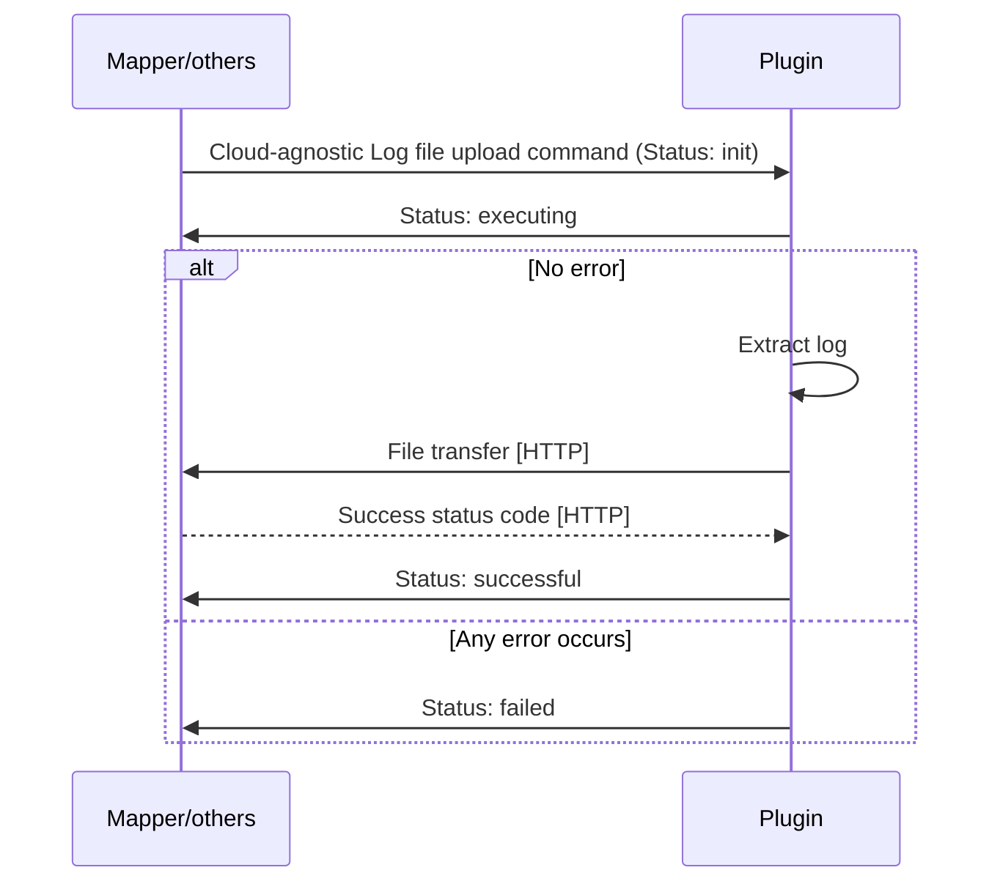

# Log file management plugin

Thin-edge provides a command plugin to fetch log files from the device.

* Log file management feature is provided with a `tedge-log-plugin` which runs as a daemon on thin-edge.
* The device owner can define the list of log files in the plugin's configuration file named `tedge-log-plugin.toml`.
* Each entry in the the `tedge-log-plugin.toml` file contains a log `type` and a `path` pattern,
  where the `type` is used to represent the logical group of log files matching the `path` pattern.
* On receipt of a log file upload command for a given `type`, 
  the log files for that type are retrieved using the `path` pattern defined in this `tedge-log-plugin.toml`,
  matched against the requested time range, search text and maximum line count.
* The plugin uploads the requested log file to the tedge file transfer repository,
  which url is given by the received log upload command.
* The list of managed log files in `tedge-log-plugin.toml` can be updated both locally as well as from cloud, for instance, by using the configuration management feature.
* However, the plugin provides no direct connection to clouds, which is responsibility of another component, i.e. cloud mapper.
* The plugin has dependency on the `tedge.toml` device configuration file to get the MQTT hostname, port and the device identifier.

## Installation

As part of this plugin installation:
* On systemd enabled devices, the service definition file for this `tedge-log-plugin` daemon is also installed as part of this plugin installation.

Once installed, the `tedge-log-plugin` is run as a daemon on the device listening to log update commands on `<root>/<identifier>/cmd/log_upload/+` MQTT topic.

## Configuration

The `tedge-log-plugin` configuration is stored by default under `/etc/tedge/plugins/tedge-log-plugin.toml`. If it does not exist on startup, the plugin creates the file with example contents.

This [TOML](https://toml.io/en/) file defines the list of log files that should be managed by the plugin.
The paths to these files can be represented using [glob](https://en.wikipedia.org/wiki/Glob_(programming)) patterns.
The `type` given to these paths are used as the log type associated to a log path.

```toml title="file: /etc/tedge/plugins/tedge-log-plugin.toml"
files = [
  { type = "mosquitto", path = '/var/log/mosquitto/mosquitto.log' },
  { type = "software-management", path = '/var/log/tedge/agent/software-*' },
  { type = "c8y_CustomOperation", path = '/var/log/tedge/agent/c8y_CustomOperation/*' }
]
```

The `tedge-log-plugin` parses this configuration file on startup for all the `type` values specified,
and sends the supported log types message to MQTT local broker on `<root>/<identifier>/cmd/log_upload` topic with a retained flag as follows:

```sh te2mqtt
tedge mqtt pub -r '<root>/<identifier>/cmd/log_upload' '{
  "types" : [ "mosquitto", "software-management", "c8y_CustomOperation" ]
}'
```

The plugin continuously watches this configuration file for any changes and resends the JSON message with the `type`s in this file,
whenever it is updated.

:::note
If the file `/etc/tedge/plugins/tedge-log-plugin.toml` is ill-formed or cannot be read,
then a JSON message with an empty array for the `types` field is sent, indicating no log files are tracked.
:::

## Handling log upload commands

The plugin establishes the MQTT connection to a broker for `mqtt.bind.address` and `mqtt.bind.port` from the `tedge.toml` device configuration.
Then, it subscribes to the `<root>/<identifier>/cmd/log_upload/+` topic, listening for 
log file upload commands.
The `<root>/<identifier>` is defined in `tedge.toml` file as the `xxx` key.

For instance, if the `<root>/<identifier>` is defined as `te/device/main//`, the plugin subscribes to the following topic.

```sh te2mqtt
tedge mqtt sub 'te/device/main///cmd/log_upload/+'
```

A new log file upload command with the ID "1234" is published by another component as below.

```sh te2mqtt
tedge mqtt pub -r 'te/device/main///cmd/log_upload/1234' '{
  "status": "init",
  "uploadUrl": "http://127.0.0.1:8000/tedge/file-transfer/main/log_upload/mosquitto-1234",
  "logType": "mosquitto",
  "dateFrom": "2013-06-22T17:03:14.000+02:00",
  "dateTo": "2013-06-23T18:03:14.000+02:00",
  "searchText": "ERROR",
  "maximumLines": 1000
}'
```

The plugin then checks the `tedge-log-plugin.toml` file for the log type in the incoming message (`mosquitto`),
retrieves the log files using the `target` glob pattern provided in the plugin config file,
including only the ones modified within the date range(`2013-06-22T17:03:14.000+02:00` to `2013-06-23T18:03:14.000+02:00`),
with the content filtered by the search text(`ERROR`) and the maximum line count(`1000`).

This filtered content is then uploaded to the given url as `uploadUrl` via HTTP PUT request.

During the process, the plugin updates the command status via MQTT
by publishing a retained message to the topic `<root>/<identifier>/cmd/log_upload/<id>`,
which is the same topic as the one where the command is received.

On a reception of a new log file upload command, the plugin updates the status to `executing `.
On a reception of the HTTP success status code after uploading a file to the file transfer repository, the plugin updates the status to `successful`.
If any unexpected error occurs, the plugin updates the status to `failed` with `reason`.

So, the operation status update message for the above example looks like below.

```sh te2mqtt
tedge mqtt pub -r 'te/device/main///cmd/log_upload/1234' '{
  "status": "failed",
  "reason": "The target log file for 'mosquitto' does not exist.",
  "uploadUrl": "http://127.0.0.1:8000/tedge/file-transfer/main/log_upload/mosquitto",
  "logType": "mosquitto",
  "dateFrom": "2013-06-22T17:03:14.000+02:00",
  "dateTo": "2013-06-22T18:03:14.000+02:00",
  "searchText": "ERROR",
  "maximumLines": 1000
}'
```

### Flow



## Usage

```sh
tedge-log-plugin --help
```

```run command="tedge-log-plugin --help" lang="text" title="Output"
Thin-edge device log file retriever

USAGE:
    tedge-log-plugin [OPTIONS]

OPTIONS:
        --config-dir <CONFIG_DIR>
            [default: /etc/tedge/plugins]

        --debug
            Turn-on the debug log level.

            If off only reports ERROR, WARN, and INFO If on also reports DEBUG and TRACE

    -h, --help
            Print help information

    -V, --version
            Print version information

The thin-edge `CONFIG_DIR` is used to store:
  * tedge-log-plugin.toml - the configuration file that specifies which logs to be retrieved
```

## Logging

The `tedge-log-plugin` reports progress and errors to the OS journal which can be retrieved using `journalctl`.

## Check points for developer (this section will be deleted later)

* Stop creating any supported operation file from the plugin. Mapper will address it on the reception of the log type declaration message.
* Renaming the toml file from `c8y-log-plugin.toml` to `tedge-log-plugin.toml`.
* The location of the toml file. Change from `/etc/tedge/c8y/c8y-log-plugin.toml` to `/etc/tedge/plugins/tedge-log-plugin.toml`.
* Create a `tedge-log-plugin.toml` file with example contents if it does not exist on startup.
* All MQTT messages must be published with a retain flag.
* All JSON deserializer must accept unknown fields.

### Drop 1 only

* The `<root>/<identifier>` is hard-coded to `te/device/main//`, thus, supporting only main device. So,
  * The topic for log type declaration: hard-code to `te/device/main///cmd/log_upload`.
  * The topic for receiving/updating operation: hard-code to `te/device/main///cmd/log_upload/+`. (`+` is for a command id)
* Use `mqtt.bind.address` and `mqtt.bind.port` from tedge config API for MQTT connection.

### Drop 2

* Get `<root/identifier>` from `xxx` of tedge config API. (The key `xxx` must be specified later.)

