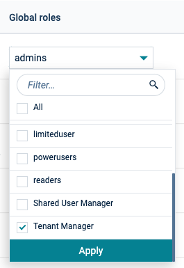

import UserContext from '@site/src/components/UserContext';
import UserContextForm from '@site/src/components/UserContextForm';

:::tip
#### User Context {#user-context}

You can customize the documentation and commands shown on this page by providing relevant settings which will be reflected in the instructions. It makes it even easier to explore and use %%te%%.

<UserContextForm settings="DEVICE_ID,C8Y_URL,C8Y_USER" />

The user context will be persisted in your web browser's local storage.
:::

The very first step to enable %%te%% is to connect your device to the cloud.
* This is a 10 minutes operation to be done only once.
* It establishes a permanent connection from your device to the cloud end-point.
* This connection is secure (encrypted over TLS), and the two peers are identified by x509 certificates.
* Sending data to the cloud will then be as simple as sending data locally.

The focus is here on connecting to [Cumulocity](https://cumulocity.com/docs/sector/getting_started/).
See this [tutorial](connect-azure.md), if you want to connect Azure IoT instead.
See this [tutorial](connect-aws.md), if you want to connect AWS IoT instead.

Before you try to connect your device to Cumulocity, you need:
* The url of the endpoint to connect (e.g. `eu-latest.cumulocity.com`).
* Your credentials to connect Cumulocity:
    * Your tenant identifier (e.g. `t00000007`), a user name and password.
    * None of these credentials will be stored on the device.
    * These are only required once, to register the device.

If not done yet, [install %%te%% on your device](../install/index.md).

You can now use the [`tedge` command](../references/cli/index.md) to:
* [create a certificate for you device](connect-c8y.md#create-the-certificate),
* [make the device certificate trusted by Cumulocity](connect-c8y.md#make-the-device-trusted-by-cumulocity),
* [connect the device](connect-c8y.md#connect-the-device), and
* [send your first telemetry data](#sending-your-first-telemetry-data).

:::tip
If you run into any errors, check the [Common errors](#common-errors) section to help diagnose and fix the problem.
:::

## Configure the device

To connect the device to the Cumulocity, one needs to set the URL of your Cumulocity tenant and the root certificate as below.

Set the URL of your Cumulocity tenant.

<UserContext>

```sh
sudo tedge config set c8y.url $C8Y_URL
```

</UserContext>

Set the path to the root certificate if necessary. The default is `/etc/ssl/certs`.

```sh
sudo tedge config set c8y.root_cert_path /etc/ssl/certs
```

This will set the root certificate path of the Cumulocity.
In most of the Linux flavors, the certificate will be present in `/etc/ssl/certs`.
If not found download it from [here](https://www.identrust.com/dst-root-ca-x3).

### Custom domain

If you are using the Cumulocity [custom domain feature](https://cumulocity.com/docs/enterprise-tenant/customization/#domain-name), then you need to set two urls instead of one, as the HTTP and MQTT endpoints on custom domains are different because the custom domain only applies to the HTTP endpoint. The MQTT endpoint must point to the underlying Cumulocity instance.

For example, below shows setting the HTTP and MQTT endpoints:

<UserContext>

```sh
tedge config set c8y.http "$C8Y_URL"
tedge config set c8y.mqtt "t12345.cumulocity.com:8883"
```

</UserContext>

:::tip
If you have `curl` and `jq` installed, then you can check if you are using a custom domain by executing the following command. If the response includes a different domain than the url used in the curl command, then you are using a custom domain, and you should use the output to set the `c8y.mqtt` thin-edge.io setting instead.

<UserContext>

```sh
curl -sfL https://$C8Y_URL/tenant/loginOptions | jq -r '.loginOptions[] | select(.loginRedirectDomain) | .loginRedirectDomain'
```
</UserContext>

:::


## Connecting to Cumulocity server signed with self-signed certificate

If the Cumulocity instance that you're connecting to, is signed with a self-signed certificate(eg: Cumulocity Edge instance),
then the path to that server certificate must be set as the c8y.root_cert_path as follows:

```sh
sudo tedge config set c8y.root_cert_path /path/to/the/self-signed/certificate
```

:::info
This is the certificate chain of the server and not the device's certificate kept at `/etc/tedge/device-certs` directory.
:::

If the Cumulocity server's certificate chain file isn't available locally, it can be downloaded using a web browser or using some other
third-party tools like openssl command as follows:

<UserContext>

```sh
openssl s_client -connect $C8Y_URL:443 < /dev/null 2>/dev/null \
| sed -ne '/-BEGIN CERTIFICATE-/,/-END CERTIFICATE-/p'
```

</UserContext>

## Create the certificate

The `tedge cert create` command creates a self-signed certificate which can be used for testing purpose.

A single argument is required: an identifier for the device.
This identifier will be used to uniquely identify your devices among others in your cloud tenant.
This identifier will be also used as the Common Name (CN) of the certificate.
Indeed, this certificate aims to authenticate that this device is actually the device with that identity.

<UserContext>

```sh
sudo tedge cert create --device-id "$DEVICE_ID"
```

</UserContext>

```text title="Output"
Certificate was successfully created
```

You can then check the content of that certificate.

```sh
sudo tedge cert show
```

<UserContext>

```text title="Output"
Device certificate: /etc/tedge/device-certs/tedge-certificate.pem
Subject: CN=$DEVICE_ID, O=Thin Edge, OU=Test Device
Issuer: CN=$DEVICE_ID, O=Thin Edge, OU=Test Device
Valid from: Tue, 09 Feb 2021 17:16:52 +0000
Valid up to: Tue, 11 May 2021 17:16:52 +0000
Thumbprint: CDBF4EC17AA02829CAC4E4C86ABB82B0FE423D3E
```

</UserContext>

You may notice that the issuer of this certificate is the device itself.
This is a self-signed certificate.
To use a certificate signed by your Certificate Authority,
see the reference guide of [`tedge cert`](../references/cli/tedge-cert.md).

## Make the device trusted by Cumulocity

For a certificate to be trusted by Cumulocity,
one needs to add the certificate of the signing authority to the list of trusted certificates.
In the Cumulocity GUI, navigate to "Device Management/Management/Trusted certificates"
in order to see this list for your Cumulocity tenant.

Here, the device certificate is self-signed and has to be directly trusted by Certificate.
This can be done:
* either with the GUI: upload the certificate from your device (`/etc/tedge/device-certs/tedge-certificate.pem`)
  to your tenant "Device Management/Management/Trusted certificates".
* or using the `tedge cert upload c8y` command.

<UserContext>

```sh
sudo tedge cert upload c8y --user "$C8Y_USER"
```

</UserContext>

## Connect the device

Now, you are ready to run `tedge connect c8y`.
This command configures the MQTT broker:
* to establish a permanent and secure connection to the cloud,
* to forward local messages to the cloud and vice versa.

Also, if you have installed `tedge-mapper`, this command starts and enables the tedge-mapper-c8y systemd service.
At last, it sends packets to Cumulocity to check the connection.
If your device is not yet registered, you will find the digital-twin created in your tenant after `tedge connect c8y`!

```sh
sudo tedge connect c8y
```

```text title="Output"
Checking if systemd is available.

Checking if configuration for requested bridge already exists.

Validating the bridge certificates.

Creating the device in Cumulocity cloud.

Saving configuration for requested bridge.

Restarting mosquitto service.

Awaiting mosquitto to start. This may take up to 5 seconds.

Enabling mosquitto service on reboots.

Successfully created bridge connection!

Sending packets to check connection. This may take up to 2 seconds.

Connection check is successful.

Checking if tedge-mapper is installed.

Starting tedge-mapper-c8y service.

Persisting tedge-mapper-c8y on reboot.

tedge-mapper-c8y service successfully started and enabled!

Enabling software management.

Checking if tedge-agent is installed.

Starting tedge-agent service.

Persisting tedge-agent on reboot.

tedge-agent service successfully started and enabled!
```

If your device does not have internet access and you want to create the bridge configuration, you can run a `tedge connect c8y` with the `--offline` flag.

```sh
sudo tedge connect c8y --offline
```

```text title="Output"
Checking if systemd is available.

Checking if configuration for requested bridge already exists.

Validating the bridge certificates.

Offline mode. Skipping device creation in Cumulocity cloud.

Saving configuration for requested bridge.

Restarting mosquitto service.

Awaiting mosquitto to start. This may take up to 5 seconds.

Enabling mosquitto service on reboots.

Successfully created bridge connection!

Offline mode. Skipping connection check.

Checking if tedge-mapper is installed.

Starting tedge-mapper-c8y service.

Persisting tedge-mapper-c8y on reboot.

tedge-mapper-c8y service successfully started and enabled!

Enabling software management.

Checking if tedge-agent is installed.

Starting tedge-agent service.

Persisting tedge-agent on reboot.

tedge-agent service successfully started and enabled!
```

If the device certificate is trusted by Cumulocity, the %%te%% instance will automatically connect to the cloud once connectivity is restored.

## Sending your first telemetry data

Sending data to Cumulocity is done using MQTT over topics prefixed with `c8y`.
Any messages sent to one of these topics will be forwarded to Cumulocity.
The messages are expected to have a format specific to each topic.
Here, we use `tedge mqtt pub` a raw Cumulocity SmartRest message to be understood as a temperature of 20°C.

```sh te2mqtt formats=v1
tedge mqtt pub c8y/s/us 211,20
```

To check that this message has been received by Cumulocity,
navigate to:

Device Management &rarr; Devices &rarr; All devices &rarr; `device_id` &rarr; Measurements

You should observe a "temperature measurement" graph with the new data point.

## Common errors {#common-errors}

Below shows some common errors that can be experienced when trying to upload the device certificate or connect to Cumulocity.

### Connection closed by peer {#common-errors-closed-by-peer}

If you're using a VPN it is possible that it is blocking the outgoing Cumulocity MQTT port that %%te%% uses, and sometimes it is not so obvious that the communication is being blocked by the VPN or firewall as tools like netcat (`nc`) might show that the port is available, however this does not show what responded to the request (so it could be the VPN responding and not Cumulocity).

Use the following command to check if the Cumulocity URL and MQTT Port are reachable from the device.

```sh
openssl s_client -connect "$(tedge config get c8y.mqtt)" < /dev/null
```

The output of the command should print the information about the certificates of the URL and port that you are trying to connect to. If you don't see any information about the certificates (e.g. the `Certificate chain` section is missing), then it is likely that the VPN's configuration or firewall is routing or blocking the communication, so try the same command with the VPN switched off.

Below shows an example of what is expected when communicating with the `eu-latest.cumulocity.com` Cumulocity instance, not that the `CN=*.eu-latest.cumulocity.com` matches the URL that was being checked against.

```text title="Output"
Connecting to 172.65.163.117
CONNECTED(00000005)
depth=2 C=US, ST=Arizona, L=Scottsdale, O=GoDaddy.com, Inc., CN=Go Daddy Root Certificate Authority - G2
verify return:1
depth=1 C=US, ST=Arizona, L=Scottsdale, O=GoDaddy.com, Inc., OU=http://certs.godaddy.com/repository/, CN=Go Daddy Secure Certificate Authority - G2
verify return:1
depth=0 CN=*.eu-latest.cumulocity.com
verify return:1
---
Certificate chain
 0 s:CN=*.eu-latest.cumulocity.com
   i:C=US, ST=Arizona, L=Scottsdale, O=GoDaddy.com, Inc., OU=http://certs.godaddy.com/repository/, CN=Go Daddy Secure Certificate Authority - G2
   a:PKEY: rsaEncryption, 2048 (bit); sigalg: RSA-SHA256
   v:NotBefore: Dec 24 16:12:09 2024 GMT; NotAfter: Jan 25 16:12:09 2026 GMT
# ...
```

### InvalidCertificate(NotValidForName) {#common-errors-invalid-certificate}

If you receive the following error, then you are most likely using the [custom domain feature](https://cumulocity.com/docs/enterprise-tenant/customization/#domain-name), and should see the [custom domain instructions](#custom-domain) to configure the correct HTTP and MQTT endpoints.

```sh
ERROR: Custom { kind: InvalidData, error: InvalidCertificate(NotValidForName) }
Error: failed to connect to Cumulocity cloud.

Caused by:
    Connection check failed
```

### 401 - Unauthorized {#common-errors-401}

The 401 (Unauthorized) error means either the user and/or password is invalid for the configured Cumulocity url that was set in the `tedge config set c8y.url <url>` command.

Check the following items to help you diagnose the root cause of the problem:

* Check the configured `c8y.url`. Copy/paste the url into a Web Browser to validate that it does open the intended Cumulocity tenant
* Check your username. The user/email is case-sensitive, so make sure the user matches your configured Cumulocity user
* Check your password. Use copy/paste to enter your password as this eliminates typos
* Check that you are not using a SSO user. SSO users are not permitted to use the REST API calls which the `tedge cert upload c8y` command is using. Please create a new Cumulocity user via the [Administration Page](https://cumulocity.com/docs/standard-tenant/managing-users/#to-add-a-user)


### 403 - Forbidden {#common-errors-403}

The 403 (Forbidden) error means that your user/password is correct however you do not have sufficient permissions to add the %%te%%'s device certificate to the Cumulocity's [Trusted certificates](https://cumulocity.com/docs/device-integration/device-certificates/).

Your Cumulocity user **MUST** be assigned the **Tenant Manager** Global Role in order to add new trusted certificates to Cumulocity. Global roles can be assigned to users via the Cumulocity **Administration** application under Accounts &rarr; Users &rarr; `<your username>` &rarr; Global Roles section. Below shows a screenshot of the **Tenant Manager** role that your user needs to be assigned to.



Alternatively, you can explicitly add one of the following permissions to your Cumulocity user: `ROLE_TENANT_MANAGEMENT_ADMIN` OR `ROLE_TENANT_ADMIN`, however this method requires you to be familiar with the [Cumulocity OpenAPI](https://cumulocity.com/api/core/#operation/postTrustedCertificateCollectionResource).

If you are still having trouble, please check out the official [Cumulocity documentation](https://cumulocity.com/docs/device-integration/device-certificates/#upload-your-ca-certificate).


### Address is unreachable {#common-errors-unreachable}

If you are unable to reach Cumulocity, then it is likely that your device's network is not properly configured. This could be for many different reasons, however the following checks might help you spot where the mistake is:

* Can you ping a well known DNS server?

  ```
  ping 8.8.8.8
  ```

  The exact address is not that important, it used to see if a well established/reliable IP address is reachable from your device. You may need to adjust the IP address if your ISP (Internet Service Provider) blocks it for some reason.

* Can you reach another website?

  Using Google is helpful here, as it is generally available, though you can also choose another popular/highly available website for your test.

  ```sh
  curl google.com
  ```

* Check if the configured `c8y.url` is reachable by using curl

    ```sh title="bash"
    curl "https://$(tedge config get c8y.url)/tenant/loginOptions"
    ```

    If you are having problems resolving the `c8y.url` to an IP address, then it might be worthwhile considering manually adding a nameserver to the DNS configuration file as shown below:

    ```sh title="file: /etc/resolv.conf"
    nameserver 8.8.8.8
    ```


## Next Steps

You can now:
* learn how to [send various kind of telemetry data](send-measurements.md)
  using the cloud-agnostic [%%te%% JSON data format](../understand/thin-edge-json.md),
* or have a detailed view of the [topics mapped to and from Cumulocity](../references/mappers/mqtt-topics.md#cumulocity-mqtt-topics)
  if you prefer to use directly Cumulocity specific formats and protocols.
* learn how to [add custom fragments to cumulocity](../operate/c8y/custom-fragments.md).
