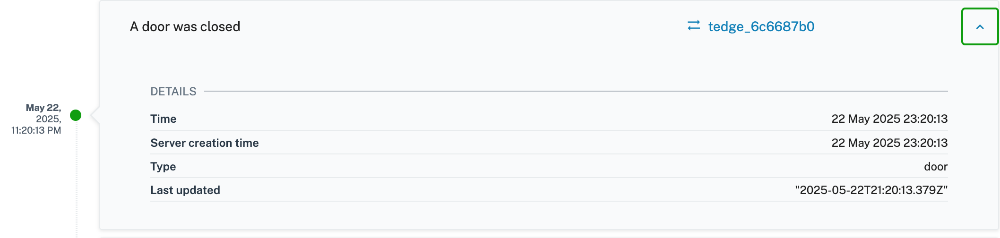
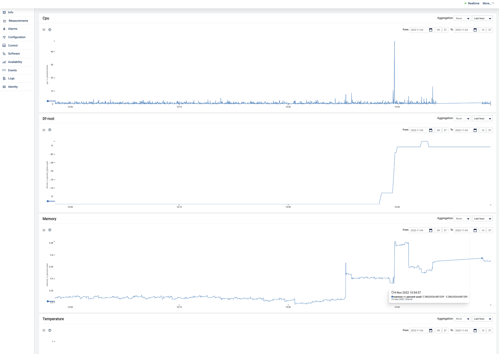
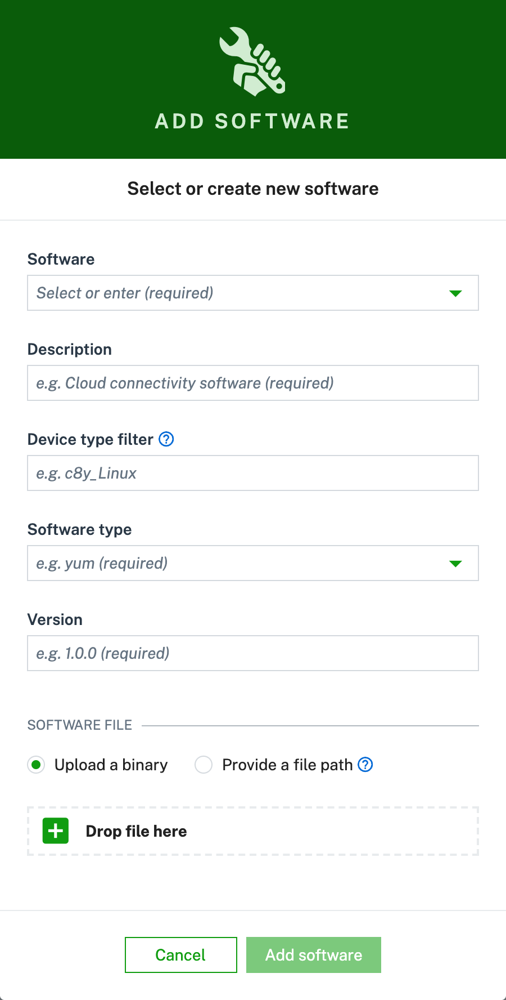
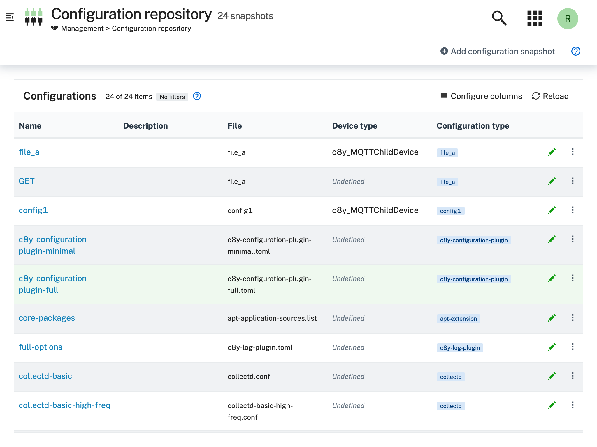
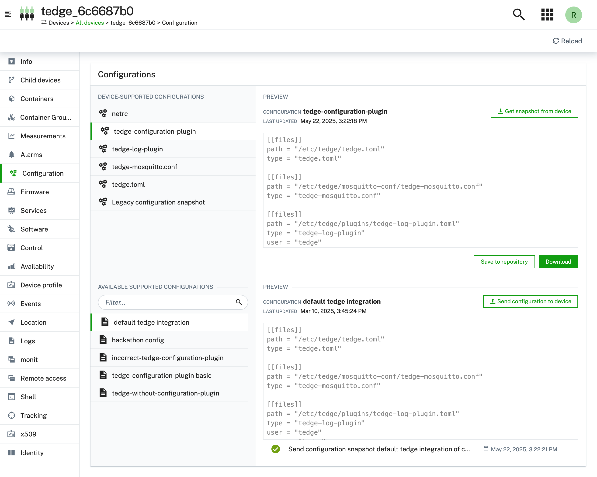
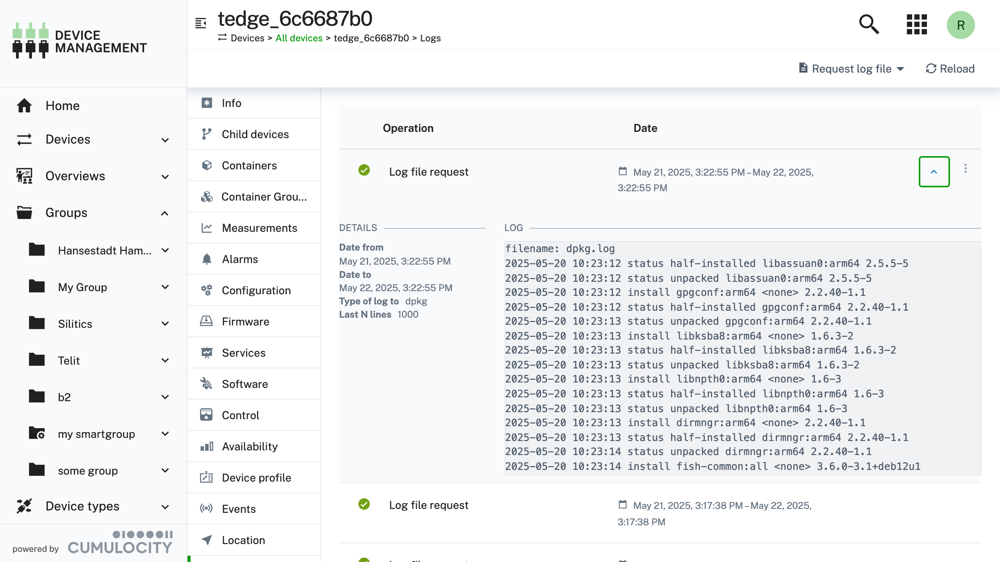

# Getting started with thin-edge.io on a Raspberry Pi

After following this tutorial you will have an overview of the installation and configuration of thin-edge.io. As an example, a Raspberry Pi is used. This tutorial explains in small steps to reach the goal of sending data to Cumulocity IoT and performing some additional device management tasks.


## Introduction

thin-edge.io is an open-source project to provide a cloud-agnostic edge framework. It is much more generic than the device management agent, so it can connect to multiple IoT cloud platforms, and it allows flexible logic executed on the device. It is optimized for a very small footprint and high performance.

The Raspberry PI is a relatively simple and cheap device but powerful. Therefore it is ideal for testing and try-outs and some production use cases.


##  Prerequisite

To follow this guide, you only need the following:
- A [Cumulocity IoT](https://www.softwareag.cloud/site/product/cumulocity-iot.html) Trial tenant.

- A Raspberry Pi (3 or 4) with Raspbian installed, for other boards and OS'es have a look [here](../references/supported-platforms.md)
- Updated device:
`
sudo apt-get update && sudo apt-get upgrade
`

## Steps

This tutorial is divided into small steps. The first three steps are needed to install and connect to Cumulocity IoT. The last three are optional but needed to get a good overview of the capabilities of thin-edge.io.

- [Step 1 Install thin-edge.io](#step-1-install-thin-edgeio)
- [Step 2 Configure and Connect to Cumulocity IoT](#step-2-configure-and-connect-to-cumulocity-iot)
- [Step 3 Sending Device Data](#step-3-sending-device-data)
- [Step 4 Monitor the device](#step-4-monitor-the-device)
- [Step 5 Add software management](#step-5-add-software-management)
- [Step 6 Manage configuration files](#step-6-manage-configuration-files)
- [Step 7 Manage Log Files](#step-7-manage-log-files)


## Step 1 Install thin-edge.io

There are two ways to install thin-edge.io:
- Use a script
- Manually

The easiest way is to use the installation script with this command:

```
curl -fsSL https://raw.githubusercontent.com/thin-edge/thin-edge.io/main/get-thin-edge_io.sh | sudo sh -s
```

This script will install the latest version of thin-edge.io with the following components:
- Mosquitto
- Command line Interface (CLI) tool
- Tedge mapper

It is possible to do the installation of thin-edge.io manually or install another version or upgrade the current version. For more information on that, please have a look [here](https://thin-edge.github.io/thin-edge.io/html/howto-guides/002_installation.html#thin-edgeio-manual-installation) for more information.

After a successful installation, it is possible to use thin-edge.io via the CLI and use the tedge commands.


### Tedge CLI

In the previous step, the CLI tool is installed, which is a very powerful

The usage is as follows:
```
tedge [OPTIONS] [SUBCOMMAND]
```
and `-h` can be used to see the help for the latest subcommand.

When running this command something similar like the following will be displayed:


```sh
tedge -h
```

```run command="tedge -h" lang="text" title="Output"
tedge is the cli tool for thin-edge.io

USAGE:
    tedge [OPTIONS] [SUBCOMMAND]

OPTIONS:
        --config-dir <CONFIG_DIR>    [default: /etc/tedge]
    -h, --help                       Print help information
        --init                       Initialize the tedge
    -V, --version                    Print version information

SUBCOMMANDS:
    cert          Create and manage device certificate
    config        Configure Thin Edge
    connect       Connect to connector provider
    disconnect    Remove bridge connection for a provider
    help          Print this message or the help of the given subcommand(s)
    init          Initialize Thin Edge
    mqtt          Publish a message on a topic and subscribe a topic
    reconnect     Reconnect command, calls disconnect followed by connect
```

Here is an [overview of the commands for the CLI tool](https://thin-edge.github.io/thin-edge.io/html/references/references.html).

The CLI will be used to configure the thin-edge.io installation on the device in the next steps.

## Step 2 Configure and Connect to Cumulocity IoT

To connect the device to the Cumulocity IoT it needs to be configured.

This URL is needed to allow the upload of the certificate to the specific tenant and the registration of the device. It can be configured via:

```sh
sudo tedge config set c8y.url "${YOUR_C8Y_URL}"
```

```sh title="Example"
sudo tedge config set c8y.url "mycompany.cumulocity.com"
```

### Certificate

thin-edge.io connects via MQTT protocol using a X.509 certificate for authentication. To do so, a certificate must be trusted by Cumulocity IoT. A certificate is trusted when it is added to the trusted certificates and is in an activated state.

First, we need to create the device certificate locally (If the device certificate is already uploaded, directly via the UI to Cumulocity IoT this step can be skipped).

```sh
sudo tedge cert create --device-id "${DEVICE_ID}"
```

```sh title="Example"
export DEVICE_ID="gateway_4932C0CE7D12"
sudo tedge cert create --device-id "${DEVICE_ID}"
```

The device id is a unique identifier e.g. the MAC address that identifies the physical device.

The certificate is uploaded to the Cumulocity IoT Tenant via:

```sh
sudo tedge cert upload c8y --user "${C8Y_USER}"
```

```sh title="Example"
sudo tedge cert upload c8y --user "john.smith@example.com"
```

If the password prompt appears, enter your password.

:::info
In a production environment, it is not recommended to use the above self-signed certificate, which is for demo purposes. If you plan to use this tutorial as a basis for production, please have a look here: [Registering devices using certificates](https://cumulocity.com/guides/10.7.0/device-sdk/mqtt/#device-certificates).
:::

### Connect

We now are ready to connect the device to Cumulocity IoT. This can be achieved via:

```sh
sudo tedge connect c8y
```

When the connection is established, the device will be created in Cumulocity IoT. When you go to Device Management &rarr; Devices &rarr; All devices, the device is visible in the list.

<p align="center">
    
</p>

## Step 3 Sending Device Data

Once your device is configured and connected to Cumulocity IoT, you can start sending measurements, events or alarms. In the standard configuration, you can not connect externally to the mosquito broker and thus the messages have to be sent directly from the device itself.

Below shows some examples on how to publish an MQTT message via the command line:

```sh te2mqtt
tedge mqtt pub '{{TOPIC}}' '{{PAYLOAD}}'
```

thin-edge.io comes with a tedge-mapper daemon. This process collects the data from the `tedge/#` topics and translates them to the tedge payloads on the `c8y/#` topics which are mapped directly to Cumulocity IoT. The mapper translates simple JSON to the desired target payload for Cumulocity IoT.

### Sending measurements

Measurements within Cumulocity IoT represent regularly acquired readings and statistics from sensors.

A simple single-valued measurement like a temperature measurement can be represented in Thin Edge JSON as follows:

```json
{"temperature": 25}
```

With the key-value pair representing the measurement type and the numeric value of the measurement. The endpoint that is supervised by the tedge-mapper for measurements is:

```sh
tedge/measurements
```

The temperature measurement described above can be sent as follows:

```sh te2mqtt
tedge mqtt pub tedge/measurements '{"temperature": 25}'
```

### Sending events

Events are used to pass real-time information, which is not just plain sensor values, through Cumulocity IoT.

A simple event can be represented in Thin Edge JSON as follows:

```json
{
  "text": "A door was closed",
  "time": "2022-06-10T05:30:45+00:00"
}
```

The endpoint that is supervised by the tedge-mapper for events is:

```sh
tedge/events/{event-type}
```

So the door open event described above can be sent as follows:

```sh te2mqtt
tedge mqtt pub tedge/events/door '{"text": "A door was closed","time": "2022-06-10T05:30:45+00:00"}'
```

When you go to events (`Device management` &rarr; `your device` &rarr; `events`), you should see this:



## Step 4 Monitor the device

With thin-edge.io device monitoring, you can collect metrics from the device and forward these device metrics to Cumulocity IoT.

thin-edge.io uses the open source component `collectd` to collect the metrics from the device. thin-edge.io translates the `collected` metrics from their native format to the thin-edge.io JSON format and then into the cloud-vendor-specific format.

Enabling monitoring on your device is a 3-steps process:

- Install collectd
- Configure collectd
- Enable thin-edge.io monitoring

### Install collectd

Because thin-edge.io uses the MQTT plugin of collectd, installation of the Mosquitto client library (either libmosquitto1 or mosquitto-clients) is required.

```sh
sudo apt-get install libmosquitto1
```

To install collectd:

```sh
sudo apt-get install collectd-core
```

### Configure collectd

thin-edge.io provides a basic collectd configuration that can be used to collect CPU, memory and disk metrics.

Simply copy the file to the main collectd configuration file and restart the daemon.

```sh
sudo cp /etc/tedge/contrib/collectd/collectd.conf /etc/collectd/collectd.conf
sudo systemctl restart collectd
```

What you should see by now is that data arrives on the `collectd/#` topics. You can check that via:

```sh te2mqtt
tedge mqtt sub 'collectd/#'
```

The output will be similar like:

```log title="Output"
INFO: Connected
[collectd/raspberrypi/df-root/percent_bytes-used] 1667205183.407:11.7998857498169
[collectd/raspberrypi/memory/percent-used] 1667205183.408:4.87045198079293
[collectd/raspberrypi/cpu/percent-active] 1667205184.398:1.52284263959391
```

### Enable Collectd

To enable monitoring on your device, you have to launch the `tedge-mapper-collectd daemon` process. This process collects the data from the `collectd/#` topics and translates them to the tedge payloads on the `c8y/#` topics.

```sh
sudo systemctl enable tedge-mapper-collectd
sudo systemctl start tedge-mapper-collectd
```

You can inspect the collected and translated metrics, by subscribing to these topics:

```sh te2mqtt
tedge mqtt sub 'c8y/#'
```

The output will be similar like:

```log title="Output"
INFO: Connected
[c8y/measurement/measurements/create] {"type":"ThinEdgeMeasurement","time":"2022-10-31T08:35:44.398000001Z","cpu":{"percent-active":{"value":1.26262626262626}},"memory":{"percent-used":{"value":4.87024847292786}}}
[c8y/measurement/measurements/create] {"type":"ThinEdgeMeasurement","time":"2022-10-31T08:35:45.398000001Z","memory":{"percent-used":{"value":4.87024847292786}},"cpu":{"percent-active":{"value":1.01522842639594}}}
[c8y/measurement/measurements/create] {"type":"ThinEdgeMeasurement","time":"2022-10-31T08:35:46.398000001Z","memory":{"percent-used":{"value":4.87024847292786}},"cpu":{"percent-active":{"value":0.759493670886076}}}
[c8y/measurement/measurements/create] {"type":"ThinEdgeMeasurement","time":"2022-10-31T08:35:47.398000001Z","memory":{"percent-used":{"value":4.87024847292786}},"cpu":{"percent-active":{"value":2.01005025125628}}}
[c8y/measurement/measurements/create] {"type":"ThinEdgeMeasurement","time":"2022-10-31T08:35:48.398000001Z","memory":{"percent-used":{"value":4.87004496506279}},"cpu":{"percent-active":{"value":0.254452926208651}}}

```

The monitoring data will appear in Cumulocity IoT on the device in the measurement section.



### Edit Collectd


To change the monitored data, it is needed to change the collectd.conf. This can be done via Cumulocity IoT. In Step 6 is explained how to do that.


## Step 5 Add software management

Software management takes care of allowing installation and management of any type of software from Cumulocity IoT. Since the type is generic, any type of software can be managed. In thin-edge.io this can be extended with plugins. For every software type, a particular plugin is needed.

The following plugins do exist:

- Docker
- APT
- Docker-compose
- Snap

To use those plugins they need to be copied to the following folder:

```sh
/etc/tedge/sm-plugins/
```

The APT plugin (provided by the `tedge-apt-plugin` package) is installed by default. You can find the other plugins in the repository. Make sure to disconnect/reconnect the device after adding plugins via:

<!-- TODO: Verify if reconnecting the mapper is really necessary! -->

```sh
sudo tedge disconnect c8y
sudo tedge connect c8y
```

### Adding new software into the software repository in Cumulocity IoT

1. Go to Cumulocity IoT

2. Go to `Management` &rarr; `Software repository` (left in the menu) and click `Add software` at the right of the top menu bar.

3. In the dialog box, enter a name for the software and confirm it by clicking `Add new`, a description and its version.

4. thin-edge.io contains a default plugin supporting `debian` packages from both `apt` repositories as well as remote locations.
    If you prefer to use packages from an `apt` repository, select the `Provide a file path` option and give an empty space (' ').

    

    If you would like to use other sources (eg. a file uploaded to your cloud or an external source), provide the full URL to the file.
    If you would like to upload your binaries, select `Upload a binary` option and upload the file to Cumulocity IoT software repository.


5. Press `Add Software` button.


### Installing software on a device

1. Go to Cumulocity IoT
2. Click `All devices` in the Devices menu, select the desired device from the device list and open its Software tab.

  The Software tab shows a list of all available software installed on the device. If a given software has a type, it will be displayed next to its name. It is possible to search for a particular software by its name or filter the list by software type.
3. Click on `Install software`, on the bottom of the page
4. Find/select the software which was added to the repository in the previous step.
5. Select the right version and click on `install`
6. Then click on `apply changes`, the software will be installed.

When a different version of the already installed software needs to be installed, choose in step 4 the installed software from the list and in step 5 the desired version.

Find more information about [how to manage the software](https://cumulocity.com/guides/users-guide/device-management/#managing-software-on-a-device) on a device.

How to [develop your own plugins](../extend/write-my-software-management-plugin.md) is described here.

## Step 6 Manage configuration files

With thin-edge.io it is possible to manage config files on a device by using the Cumulocity IoT configuration management feature as a part of Device Management.

This functionality is directly installed with the initial script. However, it is needed to configure its configuration file to add the entries for the configuration files which need to be managed.

As an example you can copy the following content to add some new configuration files which can be retrieved or applied to the device:

```toml title="file: /etc/tedge/c8y/c8y-configuration-plugin.toml"
files = [
    { path = '/etc/tedge/tedge.toml' },
    { path = '/etc/tedge/mosquitto-conf/c8y-bridge.conf', type = 'c8y-bridge.conf' },
    { path = '/etc/tedge/mosquitto-conf/tedge-mosquitto.conf', type = 'tedge-mosquitto.conf' },
    { path = '/etc/mosquitto/mosquitto.conf', type = 'mosquitto.conf' }
]
```

Where:

* `path` is the full path to the configuration file.
* `type` is a unique alias for each file entry which will be used to represent that file in Cumulocity UI.

If the configuration plugin service has not ready started, then you can configure the service to start automatically on boot, and start it now using (if you are using `systemd` on your device):

```sh
sudo systemctl enable c8y-configuration-plugin
sudo systemctl start c8y-configuration-plugin
```

Then navigate to  Cumulocity IoT Device Management and the desired device. Open its Configuration tab. You can find c8y-configuration-plugin and more are listed as supported configuration types, as declared in the plugin configuration file. Here you can save the configuration files into the repository or download them.


### Change configuration files via Cumulocity IoT.

If there is a need to change one or more configuration files, there is more than one option to follow:

* Create a whole new configuration file
* Change an existing configuration file

In this tutorial the last option is explained, there are some steps to be taken:




1. Save the configuration file to the repository (`Device management` &rarr; `configuration`. In the list of configuration files  pick  a file to change and click on `Save to repository`).

2. Go to `Management` &rarr; `configuration` snapshots repository.
3. Download the configuration file which needs to be changed (the one you saved to the repository in step 1).
4. Edit this file as needed.
5. Click on `Add configuration snapshot` (top right).
6. Fill the fields, make sure the device type is `thin-edge.io`, select the right Configuration type and add the (just edited) configuration file and click on  `Add configuration`.
7. Go back to the device and then to the configuration. In the Available supported configuration you will see the configuration file which was just created. When you click on it, you will see the content.

8. Then click on  ``` send configuration to device ``` the configuration file is uploaded to the device.
9. If you then click on ``` get snapshot from device ``` (select the right configuration file in device supported configurations), you will see the change of the configuration file.

8. Then click on  `send configuration to device` the configuration file is uploaded to the device.
9. If you then click on `get snapshot from device` (select the right configuration file in device-supported configurations), you will see the change of the configuration file.




### Change collectd configuration file via Cumulocity IoT.

To change the collectd metrics of the device, which are displayed in Cumulocity IoT, the next steps are needed. These are similar to the steps in the previous paragraphs.


1. Add a new entry to the `files` section of the plugin's configuration file

    ```toml title="file: /etc/tedge/c8y/c8y-configuration-plugin.toml"
    files = [
      # ...
      {path = '/etc/collectd/collectd.conf', type = 'collectd.conf'},
    ]
    ```

2. Save the configuration file to the repository
3. Go to `Management` &rarr; `configuration` snapshots repository
4. Download the configuration file which needs to be changed
5. Edit this file as needed
6. Click on ``` Add configuration snapshot ``` (top right)
7. Fill in the fields, make sure the device type is ``` thin-edge.io ``` and select the right Configuration type and add the (just edited) configuration file.) and click on  ```Add configuration ```
8. Go back to the device and then to the configuration. In the Available supported configuration you will see the configuration file which was just created. When you click on it, you will see the content
9. Then click on  ``` send configuration toe device ``` the configuration file is uploaded to the device.
10. If you then click on get snapshot from device (select the right configuration file in device supported configurations), you will see the change of the configuration file.


## Step 7 Manage Log Files

With thin-edge.io it is possible to request log files from a device by using the Cumulocity IoT log request feature as a part of Device Management.

This functionality is also installed by default but some configuration is needed to indicate which log files the plugin should manage.

Log files can be added by creating or editing the following file with the given contents:

```toml title="file: /etc/tedge/c8y/c8y-log-plugin.toml"
files = [
  { type = "software-management", path = "/var/log/tedge/agent/software-*" },
  { type = "mosquitto", path = "/var/log/mosquitto/mosquitto.log" },
  { type = "daemon", path = "/var/log/daemon.log" },
  { type = "user", path = "/var/log/user.log" },
  { type = "apt-history", path = "/var/log/apt/history.log" },
  { type = "apt-term", path = "/var/log/apt/term.log" },
  { type = "auth", path = "/var/log/auth.log" },
  { type = "dpkg", path = "/var/log/dpkg.log" },
  { type = "kern", path = "/var/log/kern.log" }
]
```

The service can be started and enabled via:

```sh
sudo systemctl enable c8y-log-plugin
sudo systemctl start c8y-log-plugin
```

To see the content of the log files in Cumulocity IoT, take the following steps:

1. Go to device management and select the right device.

2. Select `Logs`. In this screen, you can request Log files
3. Click on `Request log file`(the top right).
4. In the next screen you can select a date range and a type of log.
5. Then click on `Request log file`.
6. Refresh the page.
7. Click on the requested log file, you should see something similar to this:



If `c8y-log-plugin.toml` is added to the `c8y-configuration-plugin.toml` it is possible to do the administration from there.

<!-- TODO: Check if restarting the c8y-log-plugin is required each time the log file is edited -->

However, keep in mind that the daemon has to be restarted every time the `/etc/tedge/c8y/c8y-log-plugin.toml` is touched via the command line.

### Final remarks and summary

With this getting started tutorial you gained some insights on how to install and configure thin-edge.io on a Raspberry Pi.

If you didn't try the optional steps in this tutorial, it might be a nice idea to work on these as you then get a better insight into the device management capabilities of thin-edge.io. Other things you can work on are capabilities like working with child devices, building your own plugin etc. Tutorials for that can be found [here](https://thin-edge.github.io/thin-edge.io/html/).
