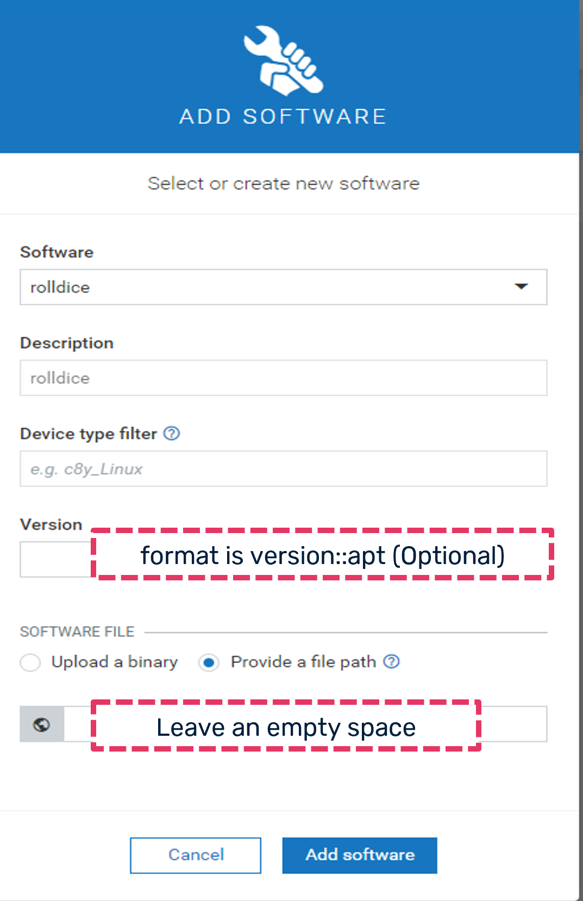

# Manage from Cumulocity the softwares on your devices
This document describes how to manage the software modules that are installed on a thin-edge device from the 
cloud using the **software management** feature of thin-edge.io.

> Note: As of now its supported only from Cumulocity cloud. Also, only supports **debian** based
 distributions(Ex: RaspberryPi OS , Ubuntu, Debian), which use the **apt** package manager.

Three components are required on your devices to enable software management:

1. Software management mapper for Cumulocity cloud
   Sm-mapper acts  as a proxy between the cloud and the device.
   This translates the cloud specific message type into device specific type and vice-versa.(Example: Cumulocity smart-rest to/from thin-edge json)
   The messages from cloud will be translated and forwarded to the `tedge_agent` and messages from `tedge_agent` will be translated and sent to cumulocity cloud.
   You can find this process with the name `tedge_mapper sm-c8y` in `ps` once it starts.

2. Software management agent
   The thin-edge software management agent is the one that calls the plugins.
   You can find this process with the name `tedge_agent` in `ps` once it starts.

3. Software management plugin
   Plugins are the interfaces that call the package manager (example: apt/apt-get) to do the software management operations (Install, Remove or update)
   You can find them in /etc/tedge/sm-plugins.
   As of now there is only one (apt) plugin is supported.

## Enable software management feature
 
Find more information about [how to install and enable software management.](../../howto-guides/0012_install_and_enable_software_management.md)
 
## Managing the device software on Cumulocity cloud
Managing the software packages installed on the devices of your Cumulocity tenant is a two steps operation.
* Populate the software repository with all the software packages and versions you plan to install.
* Trigger software update operations on the devices, to install specific packages of the repository. 

Find more information about [managing the device software](https://cumulocity.com/guides/users-guide/device-management/#managing-device-software)

### Adding new software into software repository

1. In the Software repository page, click Add software at the right of the top menu bar.
2. In the resulting dialog box,
   - to add a new software, enter a name for the software (and confirm it by clicking Create new in the resulting window),
     a description and its version.
   - to add a new version, select the software for which you want to add a new version from the dropdown list in the Software
     field and enter a version of the package. The version is optional and can be left with a white space, meaning the latest version.
   > Note: The version field format is `package_version::plugin_type_name`.The plugin type name that is provided here is used to pick
     the appropriate plugin among those installed in /etc/tedge/sm-plugins.
3. Optionally, you can define the device type filter when adding a new software.
4. As of now thin-edge.io only supports software from apt repositories. So, select the **Provide a file path** option and give an **empty space**.
5. Click Save.

Follow above mentioned steps as shown in the diagram

 

### Deleting software or software version
One can remove a software module or a specific version of it from the software repository.
Find more information about [how to delete the software or the specific software version](https://cumulocity.com/guides/users-guide/device-management/#deleting-softwares-or-software-versions)

## Managing software on a device
Find more information about [how to manage the software](https://cumulocity.com/guides/users-guide/device-management/#managing-software-on-a-device) on a device.

From the Cumulocity cloud `Software` tab of a device, software can be
* [installed](https://cumulocity.com/guides/users-guide/device-management/#to-install-software-on-a-device)
 > Note: Software profiles are not supported as of now on thin-edge.
* [updated](https://cumulocity.com/guides/users-guide/device-management/#to-update-software-on-a-device)
 > Note: Thin-edge treats install and update same.
* removed
  Hover over the software entry which you want to remove and click the **Remove** software icon and click on `Apply changes` button.