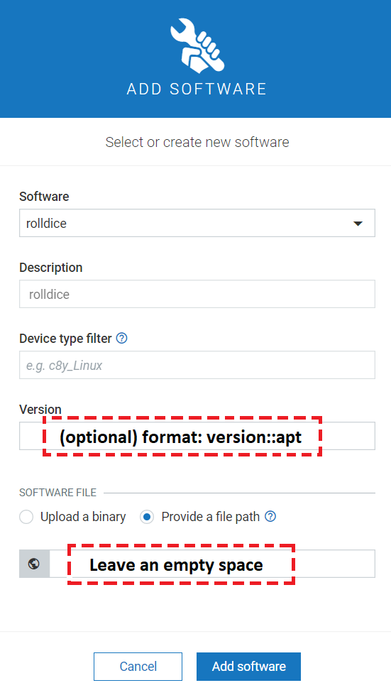

# Introduction

This document describes how to install and use the **Software management** feature in thin-edge.

> Note: As of now the software management supported only on the **debian** based distros(Ex: Ubuntu, Debian),
 which use the **apt**.

## Download and Install software management packages on the device

As a prequisite, install [tedge and tedge_mapper](../howto-guides/002_installation.md) if not installed already. 

The thin-edge software management packages are in repository on GitHub: [thin-edge.io](https://github.com/thin-edge/thin-edge.io/releases).

To download the package from github repository use the following command (use desired version):

```shell
curl -LJO https://github.com/thin-edge/thin-edge.io/releases/download/<package>_<version>_<arch>.deb
```

where:
> `version` -> thin-edge.io software management components version in x.x.x format
>
> `arch` -> architecture type (amd64, armhf)

Download `tedg_apt_plugin` and `tedge_agent`

```shell
curl -LJO https://github.com/thin-edge/thin-edge.io/releases/download/0.1.1/tedge_apt_plugin_0.1.1_amd64.deb
curl -LJO https://github.com/thin-edge/thin-edge.io/releases/download/0.2.4/tedge_agent_0.2.4_amd64.deb
```

Now the packages are downloaded, proceed to installation.
> Note: Some OSes may require you to use `sudo` to install packages and therefore all following commands may need `sudo`.

To install `tedge_apt_plugin` and `tedge_agent` on thin-edge device do:

```shell
dpkg -i tedge_apt_plugin_<version>_<arch>.deb
dpkg -i tedge_agent<version>_<arch>.deb
```

## Start and enable the software management services

The `tedge connect` will automatically start and enable the software management services.
Find more about [how to connect thin-edge device to cloud](../howto-guides/004_connect.md)

Once the thin-edge device is successfully connected to Cumulocity cloud, the **Software** option will be enabled and
the list of softwares that are presently installed on the device will be visible as shown in the figure below.


> Note: Disconnecting thin-edge device from cloud will stop and disable the software management services.

## Managing the device software on Cumulocity

More info about managing the device software can be found [here](https://cumulocity.com/guides/users-guide/device-management/#managing-device-software)

### Adding new software into software repository

1. In the Software repository page, click Add software at the right of the top menu bar.
2. In the resulting dialog box,
   - to add a new software, enter a name for the software (and confirm it by clicking Create new in the resulting window),
     a description and its version.
   - to add a new version, select the software for which you want to add a new version from the dropdown list in the Software
     field and enter a version and plugin type as **version::apt** (In the picture below the version is empty and are optional)
3. Optionally, you can define the device type filter when adding a new software.
4. Either upload a binary from the file system or specify a URL from where the software can be downloaded. As of now thin-edge does not
   support both the options. So, select the **Provide a file path file path** option and give an **empty space**.
5. Click Save.

Follow above mentioned steps as shown in the diagram

 

### Deleting software or software version

Find more information about how to delete the software or the specific software version [here](https://cumulocity.com/guides/users-guide/device-management/#deleting-softwares-or-software-versions)

## Managing software on a device

Find more information about [how to manage the software](https://cumulocity.com/guides/users-guide/device-management/#managing-software-on-a-device) on a device.

### Install software on a device
Find about how to [Install a specific software on a device](https://cumulocity.com/guides/users-guide/device-management/#to-install-software-on-a-device)
Note: Software profiles are not supported as of now on thin-edge.

### Update the software on a device
Find about how to [Update the software on a device](https://cumulocity.com/guides/users-guide/device-management/#to-update-software-on-a-device)

### Remove the software on a device
Hover over the software entry which you want to remove and click the **Remove** software icon and click on `Apply changes` button.


## Starting and Stopping the Software management services manually

For debugging purpose the services can be started/stopped manually as shown below.

### Starting the services manually

```shell
sudo systemctl start tedge-agent.service
sudo systemctl start tedge-mapper-sm-c8y.service
```

### Stopping the services manually

```shell
sudo systemctl stop tedge-agent.service
sudo systemctl stop tedge-mapper-sm-c8y.service
```
