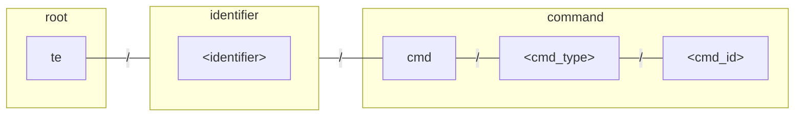

# Thin-edge Agent

Thin-edge agent is a set of services that implement the device management operations on a device.
Examples of such device management functionality include:
- software management, checking installed packages and updating these packages
- configuration management, checking and updating configuration files
- firmware management, updating the firmware of the device
- device restart
- remote access to a console on the device from the cloud
- log file management, retrieving excerpts from log files

:::note
In the current version of thin-edge, the agent features are not implemented by a single executable,
but by a set of executables:

- `tedge-agent`
- `tedge-configuration-plugin`
- `c8y-firmware-plugin`
- `tedge-log-plugin`
- `c8y-remote-access-plugin`

The short-term plan is to re-organize these plugins to move the Cumulocity aspects into the Cumulocity mapper
and to group the management operations into a single executable. 
:::

Thin-edge agent acts as a device connector:
- listening to operation requests published on the MQTT bus
- delegating the actual operations to the operating system or other components
- reporting progress of the requests

## Operation MQTT topics

Operation requests are published by the requesters on operation specific topics. The topic scheme for commands can be visualized using the diagram below.

Where the command segments are describe as follows:

|Segment|Description|
|---|----|
|&lt;identifier&gt;|The [identifier](../references/mqtt-api.md#group-identifier) (e.g. device/service) associated with the command.|
|&lt;cmd_type&gt;|Command type. Each command can define its own payload schema to allow commands to have parameters related to the command's function.|
|&lt;cmd_id&gt;|Unique command id which is unique for the command instance. e.g. `123456`, `d511a86cab95be81` etc.|

### Command examples

The following table details some example command types which are supported by thin-edge.

| Command Type    | Description | Example Topic                                  |
|-----------------|-------------|------------------------------------------------|
| software_list   | Get the list of installed software | `te/<identifier>/cmd/software_list/<cmd_id>`   |
| software_update | Install/remove software | `te/<identifier>/cmd/software_update/<cmd_id>` |
| config_snapshot | Get configuration | `te/<identifier>/cmd/config_snapshot/<cmd_id>` |
| config_update   | Set/update configuration | `te/<identifier>/cmd/config_update/<cmd_id>`   |
| restart         | Restart device | `te/<identifier>/cmd/restart/<cmd_id>`         |
| log_upload      | Upload log file/s | `te/<identifier>/cmd/log_upload/<cmd_id>`      |

The command would be interpreted differently based on the target entity.
For example, the `restart` could mean either a device restart or a service restart based on the target entity.
